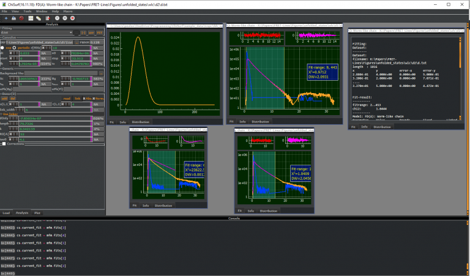
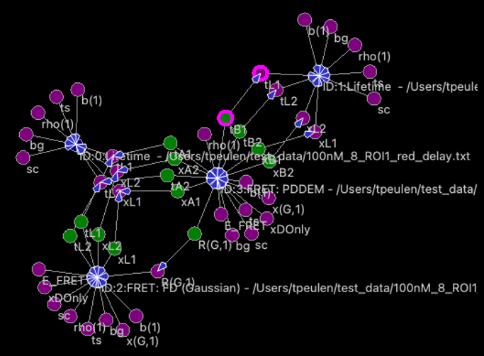

[](https://zenodo.org/badge/latestdoi/149296509)
[](https://github.com/Fluorescence-Tools/chisurf/actions/workflows/pixi-ci.yml)
[](https://github.com/Fluorescence-Tools/chisurf/releases)

# ChiSurf

ChiSurf is a software package for the global analysis of fluorescence data. It enables users to interlink, optimize, and jointly sample variables of models for time-resolved single-molecule and ensemble fluorescence experiments. By introducing dependencies across models, ChiSurf allows for the construction of complex descriptions across multiple datasets.
For a detailed explanation of the methods and implementation, please refer to the [ChiSurf Manuscript](https://doi.org/10.3390/spectroscj3020016).

<p align="center">
  
  
</p>


---

## 📖 Citation

If you use ChiSurf in your research, please cite the following publication:

> Peulen, T.-O. (2025). Exploring Time-Resolved Fluorescence Data: A Software Solution for Model Generation and Analysis. *Spectroscopy Journal*, 3(2), 16. [https://doi.org/10.3390/spectroscj3020016\:contentReference\[oaicite:20\]{index=20}](https://doi.org/10.3390/spectroscj3020016:contentReference[oaicite:20]{index=20})

This paper provides an in-depth overview of ChiSurf's capabilities, including its support for multiple fluorescence techniques such as time-correlated single-photon counting (TCSPC), fluorescence correlation spectroscopy (FCS), and single-molecule Förster resonance energy transfer (smFRET). It also discusses the software's approach to global analysis, model generation, data visualization, and parameter sampling ([MDPI][2]).

---

## Features

### General Features

* **Scripting Interface & Open API:** Flexible integration into existing workflows.
* **Interactive Analysis:** Simultaneously analyze multiple datasets.
* **Combined Analysis:** Joint analysis of different experimental techniques.

### Global Analysis

* Analysis of multiple datasets with user-defined joint model functions.
* Freely definable models for fluorescence correlation spectroscopy (FCS) and fluorescence decay analysis.
* Global analysis of multiple fluorescence decays.
* Generation of fluorescence decay histograms based on TTTR data.
* Analysis of time-resolved anisotropy decays.
* FRET-quenched fluorescence decay analysis using physical model functions.

### Fluorescence Correlation Spectroscopy (FCS)

* Analysis of FCS curves.
* Efficient correlation algorithms for TTTR data.

### Simulation of Fluorescence Observables

* Simulation of kappa² distributions based on residual anisotropies.
* Simulation of fluorescence quenching in proteins by aromatic amino acids.
* Simulation of FRET rate constant distributions based on accessible volumes.

---

## Download

Download the latest release for your platform from [GitHub Releases](https://github.com/Fluorescence-Tools/chisurf/releases):

| Platform | Artifact |
|----------|----------|
| Windows  | `ChiSurf-windows-setup_*.exe` |
| macOS    | `ChiSurf-Installer.dmg` |
| Linux    | `ChiSurf-x86_64.AppImage` |

Previous versions are available at [peulen.xyz/downloads/](https://www.peulen.xyz/downloads/).

By downloading and using ChiSurf, you agree to the following terms:

> ChiSurf is provided "as is" without warranty of any kind, express or implied. The authors of ChiSurf shall not be held liable for any claim, damages, or other liability arising from its use. Redistribution of the code is not permitted, and it is provided free of charge for both academic and commercial users.

### Installation Instructions

#### Windows

Run the downloaded `.exe` installer. For local installer builds, run `pixi run -e build build-setup`. The helper automatically downloads and installs the Inno Setup compiler into your user profile the first time it runs, so no extra manual setup is required.

#### macOS

Open the downloaded `.dmg` and drag `ChiSurf.app` into your `Applications` folder.

#### Linux

Download the `.AppImage`, make it executable, and run:
```bash
chmod +x ChiSurf-x86_64.AppImage
./ChiSurf-x86_64.AppImage
```

### Developer Install (pixi)

The recommended way to install and develop `chisurf` is using [pixi](https://pixi.sh/):

```bash
git clone https://github.com/Fluorescence-Tools/chisurf.git
cd chisurf
pixi run chisurf
```

#### Docker (Linux)

For Linux users, ChiSurf can be built and run using Docker. This ensures all system dependencies and C++ extensions are correctly configured.

1. **Build the Docker image**:
   ```bash
   docker build -t chisurf-linux -f Dockerfile.linux .
   ```

2. **Run import verification**:
   ```bash
   docker run --rm chisurf-linux
   ```

3. **Run unittests**:
   ```bash
   docker run --rm chisurf-linux pixi run test
   ```

## Local CI & Smoke Tests

- Follow `docs/ci-act.md` to reproduce the Pixi-based GitHub Actions Linux job locally with [`act`](https://github.com/nektos/act).

---

## Tutorials

Learn how to use ChiSurf through the following video tutorials:

### General Introduction  
[](https://www.youtube.com/watch?v=qa4UQnhO-8M)

### Fluorescence Decay Analysis  
[](https://www.youtube.com/watch?v=rtllur-jUag)

### Fluorescence Decay Analysis  
[](https://www.youtube.com/watch?v=rtllur-jUag)

### Fluorescence Correlation Spectroscopy (FCS)  
[](https://www.youtube.com/watch?v=k9NgYbyLyXk)

---

## Support

Please submit feature requests, questions, and bugs as GitHub issues. General questions are addressed and discussed in the Discord [group](https://discord.gg/mFEDHURSnJ).

---

## References

1. Peulen T, Opanasyuk O, Seidel C. Combining Graphical and Analytical Methods with Molecular Simulations To Analyze Time-Resolved FRET Measurements of Labeled Macromolecules Accurately. *J Phys Chem B*. 2017;121(35):8211-8241.

2. Wahl M, Gregor I, Patting M, Enderlein J. Fast calculation of fluorescence correlation data with asynchronous time-correlated single-photon counting. *Opt Express*. 2003;11(26):3583-3591.

3. Sindbert S, Kalinin S, Nguyen H, et al. Accurate distance determination of nucleic acids via Förster resonance energy transfer: implications of dye linker length and rigidity. *J Am Chem Soc*. 2011;133(8):2463-2480.

4. Kalinin S, Peulen T, Sindbert S, et al. A toolkit and benchmark study for FRET-restrained high-precision structural modeling. *Nat Methods*. 2012;9(12):1218-1225.

5. Dimura M, Peulen T-O, Sanabria H, Rodnin D, Hemmen K, Hanke CA, Seidel CAM, Gohlke H. Automated and optimally FRET-assisted structural modeling. *Nat Commun*. 2020;11:5394. https://doi.org/10.1038/s41467-020-19023-1

---

For more detailed information on ChiSurf's capabilities and applications, please refer to the full publication:

Peulen, T.-O. (2025). Exploring Time-Resolved Fluorescence Data: A Software Solution for Model Generation and Analysis. *Spectroscopy Journal*, 3(2), 16. [https://doi.org/10.3390/spectroscj3020016](https://doi.org/10.3390/spectroscj3020016)([MDPI][3])

---

[1]: https://www.researchgate.net/figure/a-Schematic-diagram-of-the-high-throughput-single-particle-fluorescence-analysis-by_fig10_346408604 "a) Schematic diagram of the high‐throughput single‐particle ..."
[2]: https://www.mdpi.com/2813-446X/3/2/16 "Exploring Time-Resolved Fluorescence Data: A Software Solution ..."
