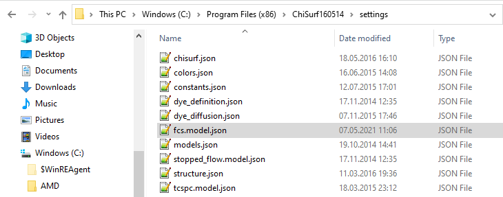
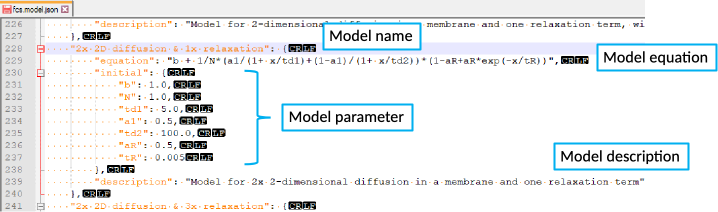

Adding the membrane-diffusion models
""""""""""""""""""""""""""""""""""""

Upon installation, ChiSurf comes with a bunch of FCS fit models; however, your required fit model might not be among them. The fit models are defined in a JSON-file ("fcs.model.json") which can be found in the installation folder of ChiSurf:

Before modifying the file, (i) create a copy on a different place as a backup and (ii) make a second copy to work on as modifying / saving directly in the programs installation folder is usually not allowed.

Open the JSON-file using a text editor, e.g. Notepad++.

Each fit model consists of four sections:

Model name

Model equation

Model parameter definition by initial values

Model description

:emphasis:`It is vital to keep this notation and take care of proper punctuation and indentation!`

Add the two following fit models for bimodal membrane diffusion with or without and additional relaxation / triplet term to your JSON-file:

For analysis of autocorrelation curves:

where :emphasis:`tD1` and :emphasis:`tD2` are the two diffusion time and :emphasis:`a1` is the fraction of :emphasis:`tD1`. :emphasis:`aR` and :emphasis:`tR` describe the triplet blinking / photophysics.

For analysis of cross-correlation curves:

In cross-correlation curves, usually no triplet blinking can be seen.

Don't forget to define reasonable initial values for each of the model parameter.

Replace the original JSON-file in your programs folder with your modified version and restart ChiSurf.

:emphasis:`Note: For changes to the JSON-file to take effect, ChiSurf must always be restarted!`
