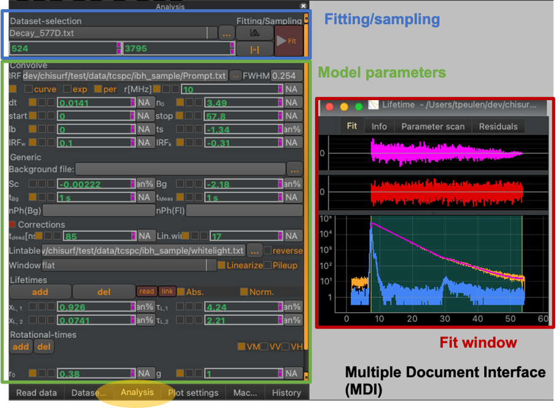

Analysis dock
-------------

The analysis dock gathers variables and parameters of the currently active fit window (see  :strong:`Fig.9`). The Analysis dock changes its content depending on the currently active fit (the activated fit window).

:strong:`Fig.9 The "Analysis" dock.` The analysis dock is activated by clicking on the yellow highlighted dock widget. The dock contains options to select different datasets, optimize/fit the free model parameters, adjust the fitting range (Fitting/sampling, :strong:`blue box`) in addition to the model parameters (:strong:`green box`) of the currently active fit, i.e., the active fit window (:strong:`red box`) in the MDI, Multiple Document Interface (gray background).

The analysis dock contains options for optimizing/fitting the currently active fit, adjusting the fitting range, and sampling over the free model parameter (see  :strong:`Fig.9`). Moreover, the displayed dataset in a dataset group can be selected.
