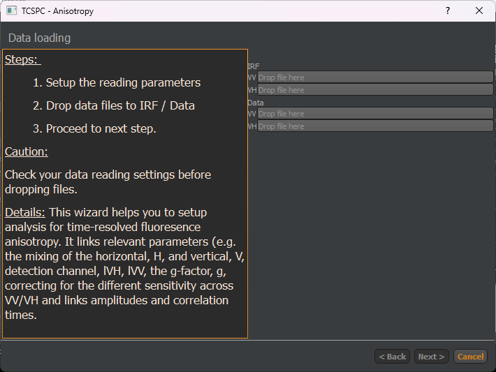
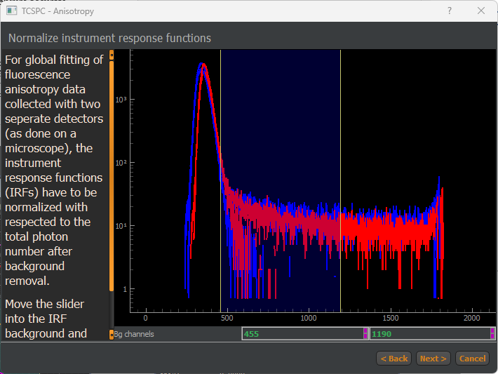
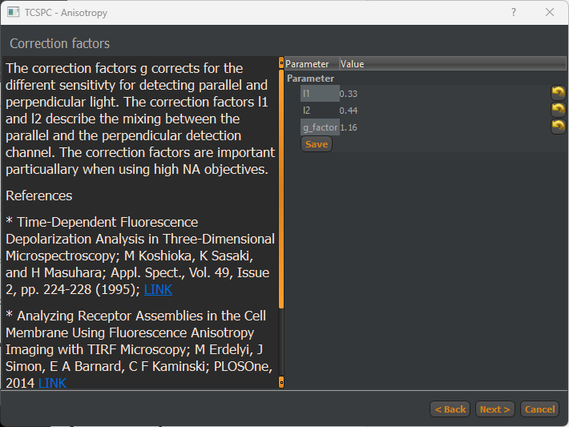
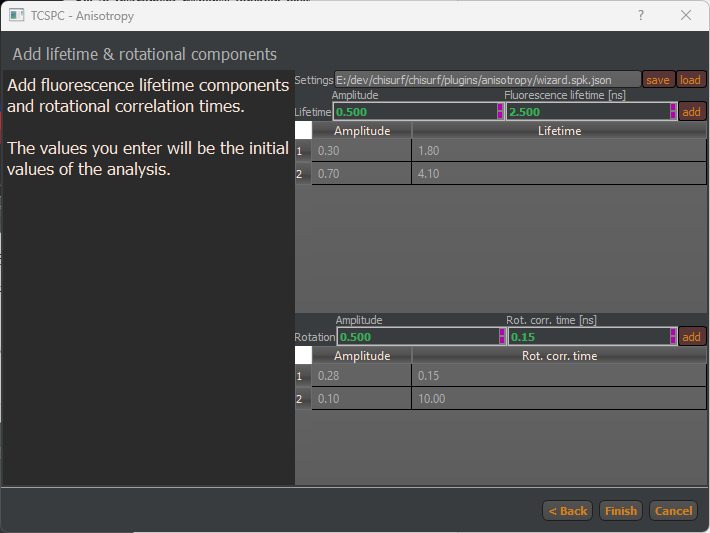
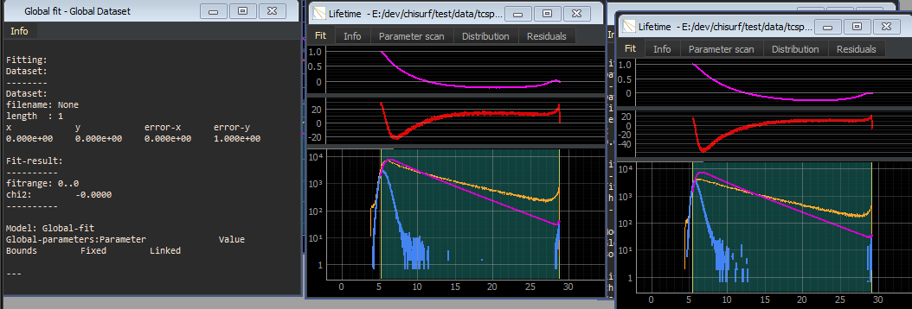

Anisotropy Wizard
-----------------

The Anisotropy Wizard in ChiSurf is a guided tool designed to facilitate the setup and analysis of time-resolved fluorescence anisotropy data. It ensures that relevant parameters are correctly configured and linked for accurate analysis. Before importing data, configure the reading parameters to ensure correct interpretation of the input files. Verify data reading settings before importing files to avoid misinterpretation of the dataset.

This wizard helps in setting up analysis by linking relevant anisotropy parameters, correcting for sensitivity differences, and ensuring proper handling of mixing effects. The g-factor (g) is an essential correction parameter that accounts for differences in sensitivity between the VV and VH detection channels. Another crucial aspect is the mixing of anisotropy when using a high numerical aperture (NA) objective, which can introduce distortions in the measurement. Proper calibration and correction are necessary to ensure accurate anisotropy calculations. A detailed tutorial on how mixing factors and g-factors can be determined by reference measurements can be found in the Tutorial section of this manual.

:strong:`Fig.26 Data loading screen of Anisotropy Wizard`. The text field on the left shows information on the current step of the wizard. The lines on the right accept files via drag-and-drop.

The first step in the analysis is reading data, which includes IRF and measurement data. The instrument response function (IRF) must be independently provided for VV and VH channels. Both IRFs are used to correct time-resolved signals and extract precise anisotropy parameters. The files are provided via drag-and-drop. Note, make sure, that the settings of the reading routine are adjusted before dropping files into 

the wizard.

:strong:`Fig.26 Instrument response function background correction`. The slider can be used to adjust a background range for the instrument response function, IRF. The plot displays the IRF in parallel and perpendicular before and after background correction.

After reading the files, the instrument response function, IRF, is prepared for convolution, i.e., constant background is subtracted from the recorded IRF and the recorded IRFs in parallel (VV) and perpendicular (VH) are normalized.

Next, default values for the G-factor and the anisotropy mixing are read from the user folder and displayed in the next page of the Anisotropy wizard.

:strong:`Fig.26 Adjustment of mixing parameters and g-factor`. The parameters are read from the user folder and can be saved using the save button.

:strong:`Fig.26 Definition of fluorescence lifetimes and rotational correlation times`.

After defining the lifetime and anisotropy spectrum the "Finish" button closes the Wizard and creates a Global, a VV, and a VH fit window.

:strong:`Fig.26 Created fit windows`: Global, VV, and VH fit window
