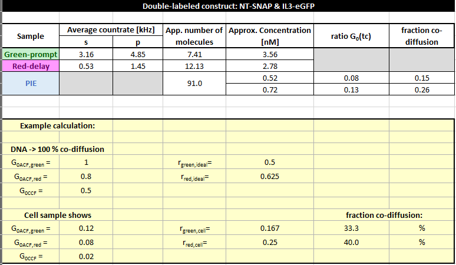

Calculation of co-diffusing molecules
^^^^^^^^^^^^^^^^^^^^^^^^^^^^^^^^^^^^^

Based on the (apparent) number of molecules in focus and our determined correction factors for the confocal overlap volume from the DNA measurements, the fraction of double-labeled molecules can be calculated.

Here, :emphasis:`NeGFP` = 7.4, :emphasis:`NSNAP` \= 12.1 and :emphasis:`Napp,PIE` = 91. Thus, the amplitudes are zero correlation time G(:emphasis:`tc`\=0) have the following values: GeGFP(0) = 0.135, GSNAP(0) = 0.082, and GPIE(0) = 0.011.

Using the correction factors from the DNA measurement, here only between 15 -26 % molecules show both labels. However, (i) the data is quite noisy and (ii) the correlation amplitudes are very low. Both factors lead to large errors.

:emphasis:`Conclusion: Search for cells with low expression level, i.e. low fluorescence and take your time to collect a decent amount of photons to correlate!`
