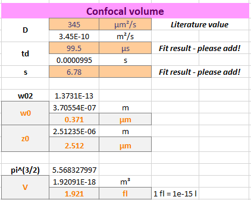
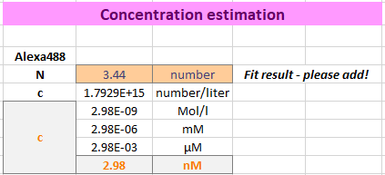

Calculations
^^^^^^^^^^^^

As A568 is larger than A488, its diffusion coefficient is reduced compared to A488.

There are different studies reporting a :strong:`DA568` in the range of 330 -360 µm²/s.

Here we use a value of :strong:`DA568` :strong:`= 363 µm²/s` 3.

As expected for a measurement at red-shifted, thus longer wavelengths of excitation and emission, the confocal detection :strong:`Veff,red` volume is increased compared to :strong:`Veff,green`.
