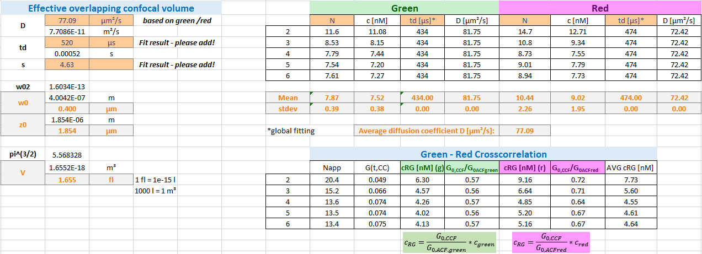

Calculations
^^^^^^^^^^^^

From our double-labeled DNA measurements, we need to derive two important parameter:

The size of the overlapping confocal detection volume :emphasis:`Veff,PIE`

The Cross-correlation amplitude, which reflects 100 % co-diffusion

The size of the overlapping confocal detection volume can be determined using the already provided equations used in the sections above for the calculations of the confocal detection volume of the green and red channel.

In a first step, we use the obtained diffusion times from our :emphasis:`DNA_gp` and :emphasis:`DNA_rd` fits and determine the translational diffusion coefficient of our DNA sample:

and

Here, we obtain a value of :strong:`DDNA,green` :strong:`= 81.8 µm²/s` and :strong:`DDNA,red` :strong:`= 72.4 µm²/s` using the value of wo from A488 and A568 dye, respectively. Thus, in average :strong:`DDNA` :strong:`= 77.1 µm²/s`.

Based on this value, we can obtain :emphasis:`w0,PIE` and :emphasis:`z0,PIE`:

and

Here, :strong:`w0,PIE` :strong:`= 400 nm` and :strong:`z0,PIE` :strong:`= 1.85 µm`. This results in a :strong:`Veff,PIE` of :strong:`1.66 fL`:

Next, we observe the amplitudes of the auto- and cross correlation functions: In an ideal system the amplitudes of the three curves, :emphasis:`DNA_gp`, :emphasis:`DNA_rd` and :emphasis:`DNA_PIE` should be identical. However, as the detection volumes differ with the excitation and emission wavelength, this is rarely the case. In the next-optimal setting, the amplitude of :emphasis:`DNA_PIE` would be identical to the amplitude of the autocorrelation curve with the lower amplitude.

In common experimental settings, the overlap of the green and red confocal detection volumes is suboptimal and the apparent amplitude of a 100 % co-diffusion sample is required for calibration.

The concentration, and thus, later the fraction of co-diffusing particles in your sample, of double-labeled particles can be calculated based on the ratio of the correlation amplitudes:

and

where the amplitudes :emphasis:`G0,ACFgreen` and :emphasis:`G0ACF,red` are the inverse of the respective number of particles, :emphasis:`Ngreen` and :emphasis:`Nred`, in focus.

Here, we obtain amplitude ratios for 100 % co-diffusion of :strong:`ratioGR` :strong:`= 0.57` for the green and of :strong:`ratioRG` :strong:`= 0.68` for the red autocorrelation curves.

Now we are ready to switch to our real samples measured in live cells.
