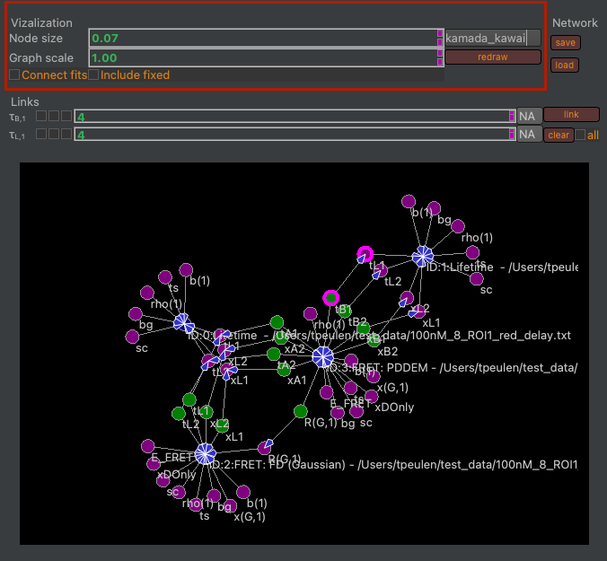
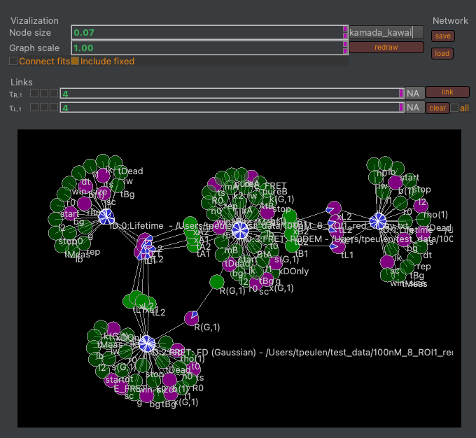

Changing visualizations
~~~~~~~~~~~~~~~~~~~~~~~

The visualization of the graph is controlled by widgets in the visualization box (:strong:`Fig.33`).

:strong:`Fig.33.` The graph visualization is controlled by the group box highlighted in red (left). The node sizes and the graph scale are controlled by respective spin boxes. The connect fits checkbox introduces additional edges between fits. The include fixed checkbox controls wether or not fixed parameters are displayed in the graph. The dropdown menu can be used to select a different algorithm for node placement.

The position of nodes can be controlled by dragging nodes of the graph.
