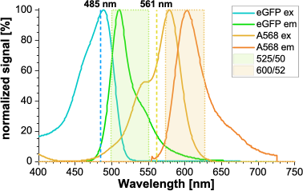

Correction factors for spectral crosstalk & direct acceptor excitation
""""""""""""""""""""""""""""""""""""""""""""""""""""""""""""""""""""""

Absorption and emission spectra of fluorophores are usually quite broad and extent over quite a wavelength range, and not seldom the spectra from green and red fluorophores used in the measurement overlap.

By introducing optical (bandpass) filters into the emission path of your setup, it is possible to minimize these effects.

However, even if these contributions to your signal are small, they might be become critical when you have a low count rate / low signal in one channel compared to the other channels.

For more detailed information on required corrections and the nomenclature of correction factors, we refer to the recently published multi-laboratory benchmark study of Hellenkamp :emphasis:`et al.` 4.
