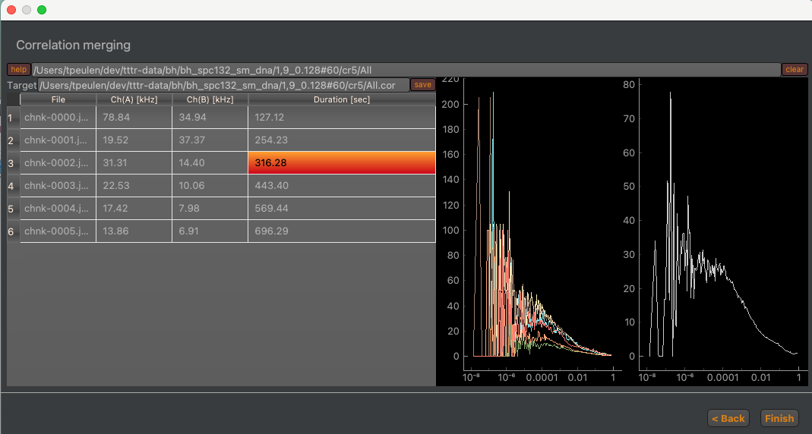

Correlation merging
~~~~~~~~~~~~~~~~~~~

Finally, the computed correlation curves can be merged (:strong:`Fig.30`). Before merging the correlation curves of the subsets into a joint correlation curve outliners (e.g. caused by aggregates) can be removed.

:strong:`Fig.30. Selecting and merging correlation curves.` The left side displays for every subset of the photon stream the count rate in the two correlation channels and the duration of the subset. Selecting a row in the left table selects the corresponding correlation curve displayed on the right-hand side. The merged correlation curve is displayed on the very right-hand side.

The curves of the subsets can be selected in the table on the left-hand side. A double click on the selected curve removes the curve from table and the merged correlation curve. The "Finish" button finalizes the pipeline. By default, the output of the pipeline is saved in the "cr5" folder.
