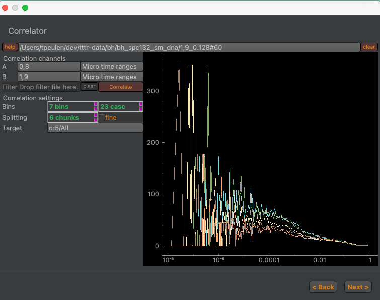

Correlator
~~~~~~~~~~

The correlator uses the generated photon selection masks and the photon stream to compute correlation functions (:strong:`Fig.29`).

:strong:`Fig.29 Interface of the correlation step in the correlation computation pipeline.` Correlation channels and selected micro time ranges for the correlation are defined in the "Correlation" channel group. The number of correlation bins and the splitting of the photon traces into subsets are defined in the "Correlation settings" group. The number of bins per "cascade" defines the number of correlation bins. The "fine" checkbox enables a full correlation that utilizes the macro and the micro time in the correlation computation. The "Correlate" button initiates the correlation computations. Computed correlations are displayed in the plot to the right. The computed correlations are stored in the output folder defined in the "Target" field.

The correlation step computed for the photons selected by the photon mask correlation functions. The selected photons are split into subsets. For each subset a correlation curve is computed. The output of the correlation computation is stored for each subset in JSON files that refer to the photon filter and contain information on the correlation setting along with the corresponding correlation curves.
