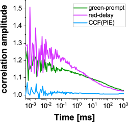
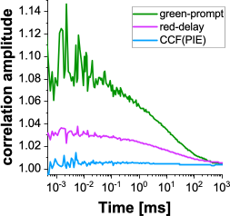

Crosstalk-induced correlations
^^^^^^^^^^^^^^^^^^^^^^^^^^^^^^

Based on these single-color experiments also one can test how much artificial / unwanted cross-correlation into the respective other color channel is present.

For this, we export and plot the following correlations:

From the β2AR-eGFP-IL3 measurements: red channels in the delay time window and PIE cross-correlation (green channel prompt time window with red channels in the delay time window)

From the NT-SNAP-β2AR measurements: green channels in the prompt time window and PIE-cross-correlation (green channel prompt time window with red channels in the delay time window)

In ideal case, all of these combinations show flat curves or better-said noise distributed around 1. Here, this is the case only for the PIE-cross-correlations. The respective "false-color" autocorrelation functions, red-delay from β2AR-eGFP-IL3 and green-prompt from CT-SNAP-β2AR, reflect the crosstalk into the red channels and the direct excitation of red fluorophore by the green excitation wavelength, respectively.

