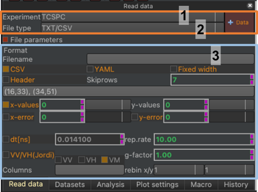
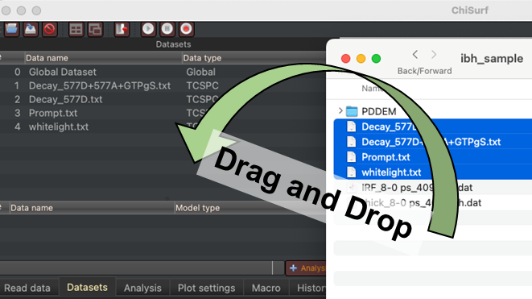
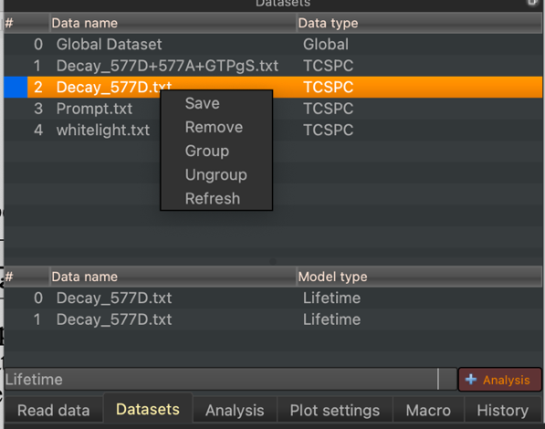
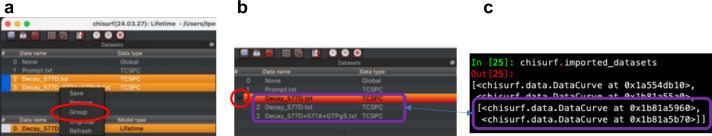

Data import
-----------

Internally, all imported data is managed in a single list (:strong:`chisurf.imported_datasets`). Elements in that list from the class :strong:`chisurf.data.ExperimentalData`. The user interface helps populating the dataset list (:strong:`Fig.4`).

:strong:`Fig.4 Data reading interface.` The data reading interface consists of three regions. The dropdown menu in the first region defines the experiment type (1). The dropdown menu in the second region defines the file type for a particular experiment type (2). In the third region, the user can specify parameters for reading a particular file type (3). In the displayed example text/comma separated data of a time-correlated single photon counting (TCSPC) experiment is being read.

To read data using the graphic user interface, first select the corresponding experiment type (:strong:`Fig.4`, 1). Afterwards select the file type of the experiment (:strong:`Fig.4`, 2). Before reading data, check the parameters that are passed to the data read (:strong:`Fig.4`, 3). Finally, you can load the dataset into ChiSurf, either by clicking on the ":strong:`+Data`" button using the key combination ":strong:`Ctrl+N`" (Windows, Linux) or ":strong:`⌘+N`" on macOS. Alternatively, multiple files of the same kind can be opened in a single step by selecting the respective files in a file explorer of your choice and dragging the selected files into the user interface to the dataset list (:strong:`Fig.5`).

User and program actions correspond to actions in the IPython prompt.

:strong:`Fig.5 Drap and drop import of datasets.` Files selected in a file explorer of your choice (here macOS Finder) can be opened by dragging selected files to the data set list.

Alternatively, files can be opened programmatically using the shell:

.. code-block:: python

  chisurf.macros.add_dataset(filename='/Users/tpeulen/dev/chisurf/test/data/tcspc/ibh_sample/Decay_577D+577A+GTPgS.txt')

The called macro will add open a dataset for the currently selected setup and with the current parameters for reading files. Programmatically, the current setup and the reading routing can be changed from the shell by assigning values to the :strong:`cs.current_experiment` and the :strong:`cs.current_setup` variable. For instance:

.. code-block:: python

  cs.current_experiment = 'FCS'
  cs.current_setup = 'Seidel Kristine'

Interactions with the graphical user interface are reflecting as commands in the programming shell.

The context menu of the data list can be used to save, remove, group and ungroup datasets (:strong:`Fig.5`). Dataset of equal data type can be group into groups. Grouping dataset can be useful when analyzing datasets of similar type, e.g., when analyzing titration data.

:strong:`Fig.6 Dataset context menu.` The context menu of the dataset list allows to save, remove, group, and ungroup datasets. The refresh option updates the data list.

To group datasets, select the corresponding dataset in the data set list and select in the context menu (right click) the group option (:strong:`Fig.7`).

:strong:`Fig.7 Grouping of datasets. (a)` The context menu of the data set list allows to group datasets. (:strong:`b`). Grouped datasets appear in the dataset list as a single tree entry that can be inspected in detail by unfolding the group (red circle). (:strong:`c`) in the programming shell grouped datasets are iterable objects.

In the shell datasets are grouped as follows:

.. code-block:: python

  chisurf.macros.group_datasets([1, 2])

Here, the numbers refer to the index of the dataset in the :strong:`chisurf.imported_datasets` list. The order of datasets in the list can be changed by editing the number of the dataset in the first column of the data list (:strong:`Fig.4`). The currently selected dataset can be accessed in the shell:

.. code-block:: python

  cs.current_dataset

Datasets that are curves be accessed by their attributes.

.. code-block:: python

  import pylab as plt
  cs.current_dataset
  plt.plot(cs.current_dataset.x, cs.current_dataset.y)

For details look at the Application Programming Interfaces, API, of ChiSurf.
