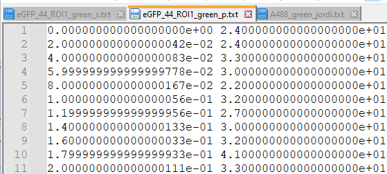
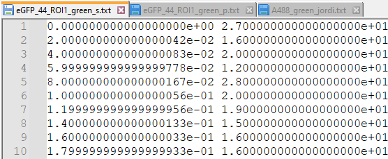
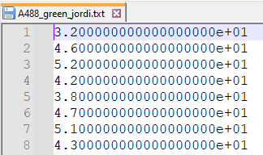
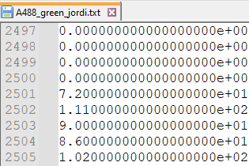
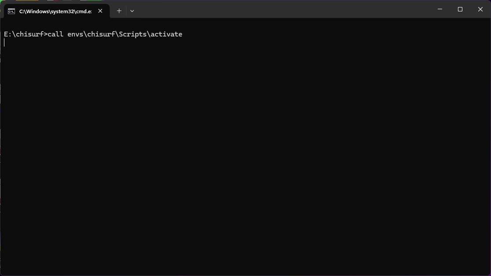
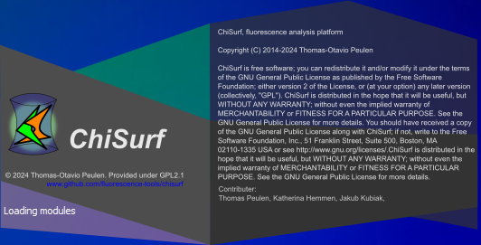
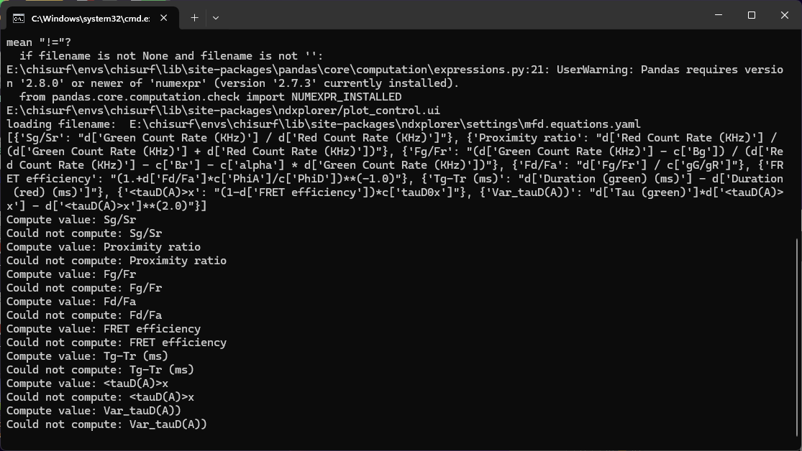
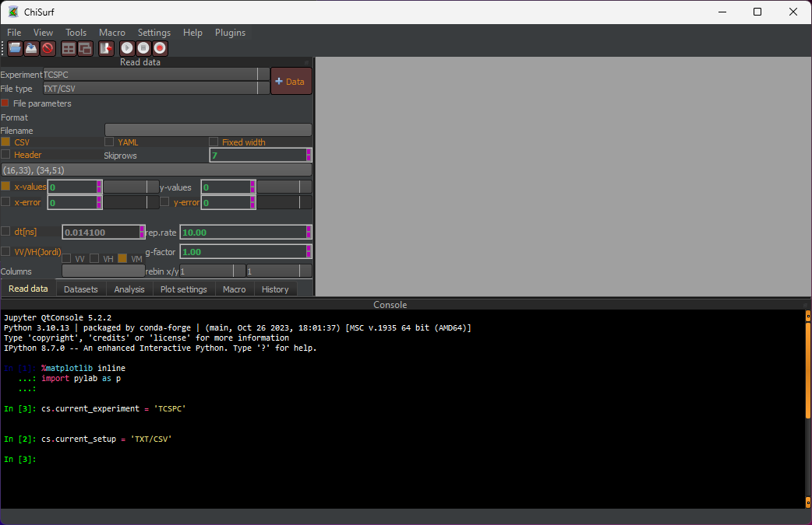

Data input and file format
""""""""""""""""""""""""""

ChiSurf can read a variety of text files and formats. For time-resolved fluorescence intensities in polarization-resolved experiments, we usually use two different file formats: (ii) two-columns/two files or (ii) single-column/single file ("Jordi-format").

In the first case, two files are required, one containing the parallel channel and one the perpendicular channel data. Both files contain two columns; the first column is the time in nanoseconds, while the second column contains the actual data (photon counts in this respective time bin).

In the second case, only a single file is required, in which the data from perpendicular and parallel channel are stacked on top of each other.

Please note that in both format no header is used, however, it can be defined to skip header rows while file loading.

I personally prefer the single-column Jordi-format as it reduces the amount of files in my data export folders by 50%, however, I need of course to remember with which time resolution (here 20 ps) the TCSPC histograms were exported.

