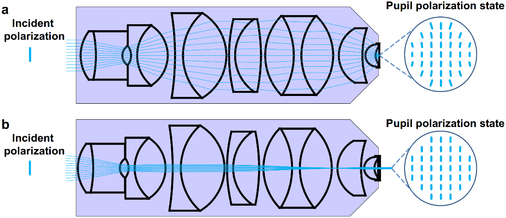

Determination of g-factor and depolarization factors using ChiSurf
------------------------------------------------------------------

High NA objectives cause a partial depolarization of the linearly polarized excitation and the collected emitted light. This influences the observed fluorescence anisotropy in fluorescence spectroscopy experiments:

:strong:`Figure 1. Depolarization introduced by a high NA microscope objective.`

(a) The microscope objective is illuminated by a linearly polarized plane wave and focuses the beam onto the sample. This mode of illumination is used in confocal microscopy. (b) The linearly polarized beam is focused into the back-focal plane of the objective (widefield illumination). The sample is illuminated by a collimated plane wave. The "pupil" polarization states in the image planes are depicted using vertically polarized incident beams. Widefield illumination (b) leads to lower loss of polarization in the illumination field than focused beam illumination (a) as confirmed by optical ray tracing simulations.

(Image taken from: )

The correction of this phenomenon has first been described already by M. Koshioka, K. Sasaki and H. Masuhara (, , Appl. Spectrosc., 1995, 49, 224–228).

In the more recent, open access publication of Erdelyi :emphasis:`et al.` a more illustrative description can be found (Erdelyi M, Simon J, Barnard EA, Kaminski CF (2014) Analyzing Receptor Assemblies in the Cell Membrane Using Fluorescence Anisotropy Imaging with TIRF Microscopy. PLOS ONE 9(6): e100526. ).

Next to the depolarization due to the objective, the different detection sensitivity of the parallel and perpendicular detector must be considered. In microscopy-based experiments, this so-called g-factor is often defined as the ratio of parallel (:emphasis:`Ip`) over perpendicular (:emphasis:`Is`) light, however, some software also uses the inverse definition. In either case, the g-factor should ideally lie close to 1.

To determine both the g-factor and polarization correction factors, :emphasis:`lp`, and :emphasis:`ls`, we use here a joint analysis of a small, fast rotating fluorophore such as Alexa, Atto or Cy fluorophores and a larger, slow rotating fluorophore such as a fluorescent protein. Please note that both selected fluorophores must show a mono-exponential rotation, i.e. proteins labelled with an organic fluorophore connected via a flexible maleimide linker or similar are not recommended.
