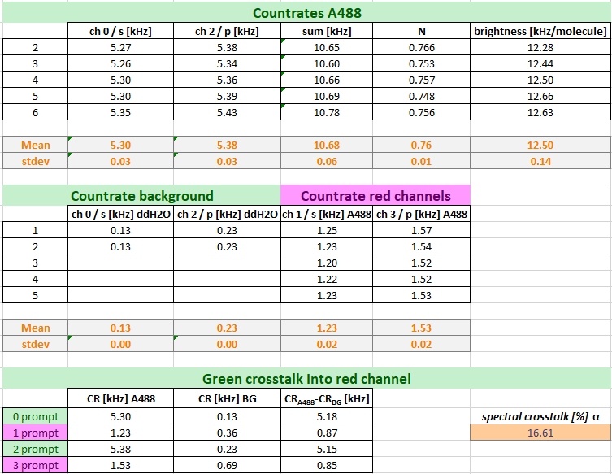
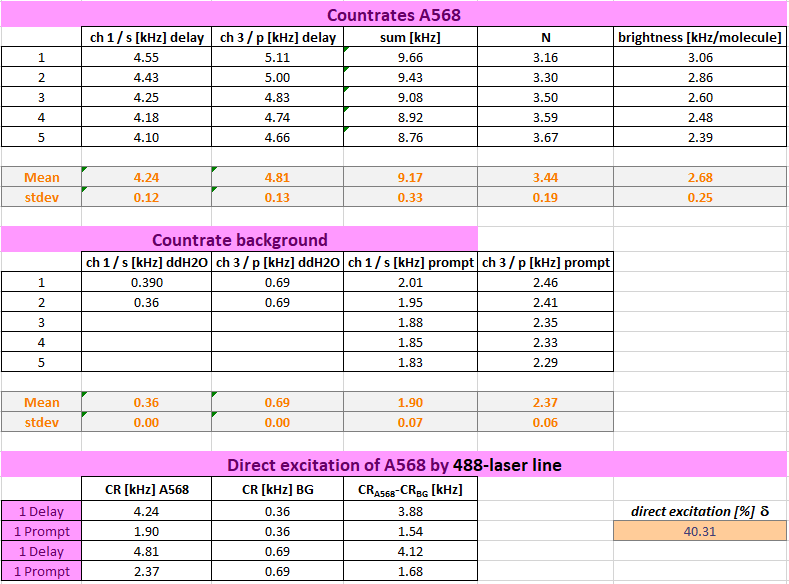

Determination of molecular brightness
"""""""""""""""""""""""""""""""""""""

After having correcting the count rates, we can now determine the molecular brightness of our fluorophores.

Note: It is advisable to monitor this molecular brightness of your calibration standards carefully as they can give you early hints about a possible misalignment and / or reduction of laser output power.

Required parameter:

Number of molecules in focus as determined from the fits above

:strong:`Ngreen`: 0.76

:strong:`Nred`: 3.44

Corrected count rates:

:strong:`CRcorr,green,0` = 5.18 kHz

:strong:`CRcorr,green,2` = 5.15 kHz

:strong:`CRcorr,red,1` = 3.88 kHz

:strong:`CRcorr,red,3` = 4.12 kHz

The molecular brightness is calculated as count per molecule and second:

#. For the data shown here, the following molecular brightness is obtained:

