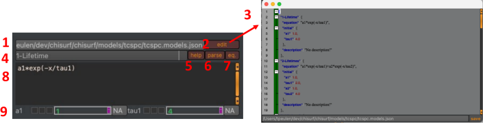

Equation parsing
~~~~~~~~~~~~~~~~

ChiSurf Equation Parser enables the computation of fluorescence decay according to any specified function, with equation parameters serving as model parameters. Users can access a list of predefined equations, which are editable to suit their needs (:strong:`Fig.23`).

:strong:`Fig.23 Fluorescence decay equation parsing.` \(1) A JSON file with a set of pre-defined equations for time-resolved fluorescence is shipped with ChiSurf. (2) The edit button opens a (3) JSON file editor that can be used to edit the pre-defined equations. (4) A dropdown menu lists the pre-defined equations. (5) Descriptions/help on the pre-defined equations can be enabled/disabled. (6) Parse button to update the model when equation was edited. (7) Button to enables/disables displaying the an editing equations. (8) equation editor. (9) Representation of parameters extracted from equation.

The Equation Parser operates by generating a curve for the equation on the time-axis, with the variable 'x' representing time. This curve is then convolved with the Instrument Response Function (IRF). ChiSurf offers various convolution modes, including fast convolution, fast periodic convolution, and curve convolution. The latter mode is slower but necessary when parsing equations. Additionally, ChiSurf handles other nuisances in a similar manner as with fluorescence lifetime-based model functions.
