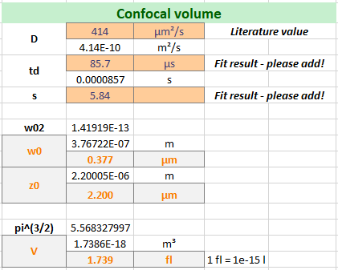
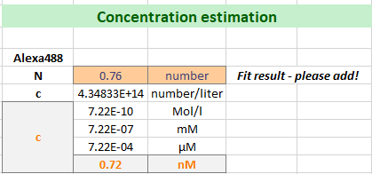

Estimation of the fluorophore concentration
^^^^^^^^^^^^^^^^^^^^^^^^^^^^^^^^^^^^^^^^^^^

Using the above determined confocal volume, the concentration of the fluorophore in your measurement solution can be estimated.

The following parameters are required:

Confocal volume :strong:`Veff,green` :strong:`= 1.74 fL`

Number of molecules in focus, :strong:`N`, from our fit: :strong:`0.76` (in average)

Avogadro's number: :strong:`NA` = :strong:`6.022*1023 mol-1`

The concentration  of the fluorophore is determined from the following relationship:

The approximated concentration of green calibration dye is calculated to be :strong:`cA488` :strong:`~ 0.72 nM.`

