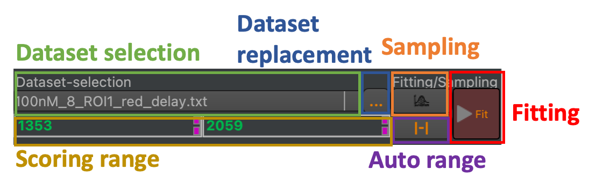

Fit interface
-------------

The analysis dock displays an interface for sampling and optimization for the currently active window in the fit window Multiple Document Interface (MDI) (:strong:`Fig.8`). The fitting and sampling interface allows to select the current dataset in a data group, replace a dataset with another loaded dataset, sample over variable model parameters, fit/optimize variable model parameters, and adjust the model range (:strong:`Fig.11`).

:strong:`Fig.11 Elements in the dataset optimization and sampling interface.` The interface can be used to select the currently displayed dataset (green box), replace the current dataset (blue box), sample over the variable model parameters (orange box), optimize/fit variable model parameters to a dataset group (red box), adjust the range of the scoring function (yellow box), and auto adjust the scoring range (purple box).
