Fit of a FCS curve
^^^^^^^^^^^^^^^^^^

Open Chisurf2016

It might take a while to open – be patient!

It has got two panels:

Left / white: Here, the data is loaded and the analysis method / model is selected. Additionally, you can use the integrated Python-console to run little scripts.

Right / grey: Here, each data set opens in its own window.

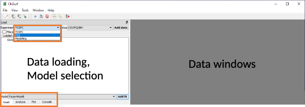

Change to the "FCS" mode und load your all ":strong:`A488_ACF_prompt.cor`:emphasis:`"` (auto correlation curves of green calibration fluorophore correlated within the prompt time window) dataset(s) by "File"  "Add dataset"or simply by "drag'n'drop" into the white area.

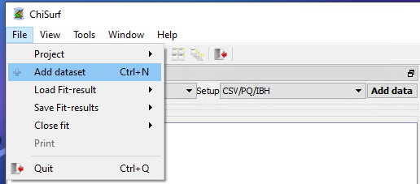

Select your loaded dataset(s) and click on "Add fit":

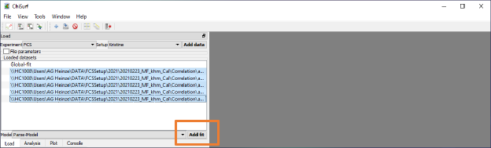

Here, five new windows will open in the grey working panel:

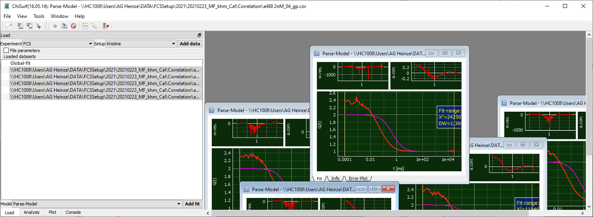

Caution! The individual windows may lie on top of each other!

Move the top-visible window aside and arrange the windows as you find it comfortable:

You can maximize the windows to see only one curve at a time. Minimize the window to see the other data again.

Alternatively, you can display each curve in full-size but in individual tabs. Then you can switch between the data by clicking on the respective tab and / or use the little arrows on the side to change between the tabs.

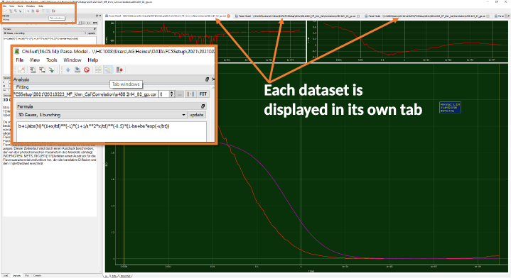

Or you can distribute all windows automatically to evenly cover the full working panel:

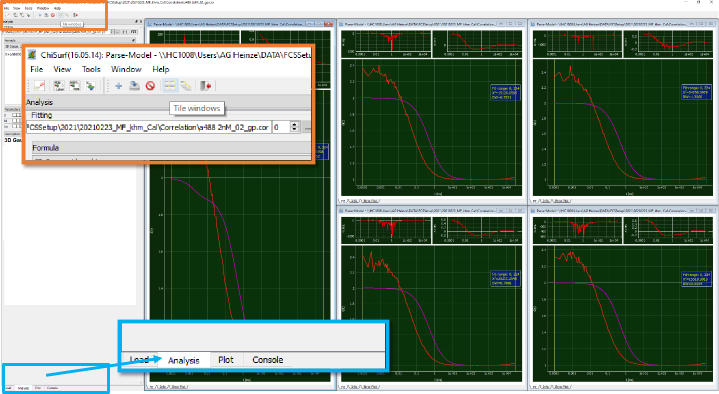

Now change to the analysis tab in the data panel and select the "3D Gauss 1 bunching" model from the drop-down menu for your first curve:

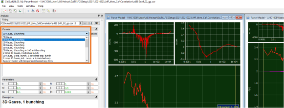

This model has six parameters:

The "1 Bunching" term as described by "ba" and "bt" is used to model the typical photophysical triplet blinking of many fluorophores in the µs time range.

Note: ChiSurf comes upon installation with a selection of pre-defined fit models, you can modify these fit models or add your own models easily.

This will be shown later.

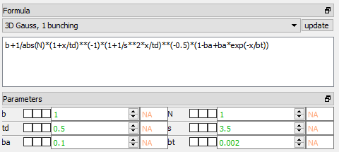

Press "Fit" for fitting:

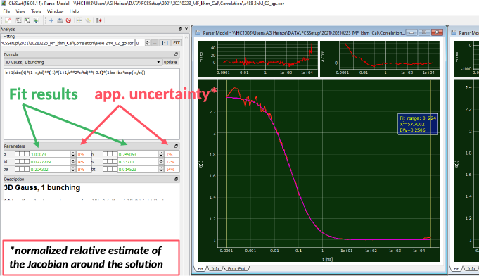

We obtain a number of molecules in the focus N = 0.75, a diffusion time td = 0.073 ms (i.e. 73 µs) and triplet blinking time constant of 14.5 µs with an amplitude of 0.20. However, from the weighted residuals and the autocorrelation of the residuals, we can see a mismatch at long correlation times: This is because the absolute measurement time in this measurement was too short to reliable obtain these values.

Next to the fit results, also the :emphasis:`normalized relative of the Jacobian Matrix around the solution` can be seen. This is :strong:`NOT` reflecting the :strong:`uncertainty` of the fit result, but the values might give a first hint whether the uncertainty is rather large or small. For more details on this topic, please check out the information provided on the following web page and the references cited herein:

For a more reliable estimate on the uncertainty of the fit parameter you have two options within ChiSurf to (i) sample the χ²-surface or (ii) to run a Markov-Chain Monte-Carlo simulation, which also allows you to obtain the mutual dependencies between the fit parameter. However, this uncertainty analysis is beyond the scope of this analysis of the calibration samples and will be shown in a different tutorial.

Here, we take advantage of multiple measurements of the same sample and take these as additional restraints.

Shorten the fit range to ~ 100 ms by grabbing the right yellow line and move it to the left:

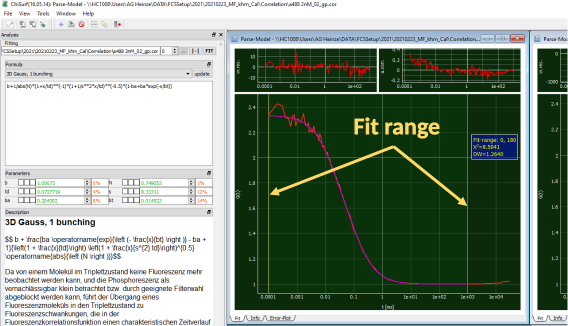

:emphasis:`Of note`: To reliably fit your diffusion time, the :strong:`baseline` (0 or 1, depends on correlation algorithm) :strong:`MUST` :strong:`be reached` in your correlation curve (or in the fit range, respectively)

Press "fit" and observe the changes:

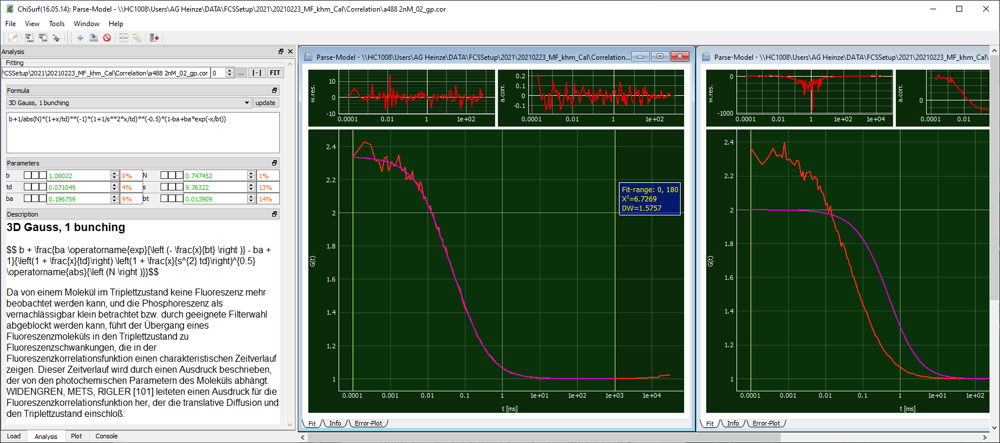

Now the shape has increased to 9.76, which is very huge and would indicate a misalignment of your system. In ideal case, the shape factor should lie between 3 - 7. The other values have changed only slightly.

Now let's add the other measurements into the play and see whether a global fit of all measurements stabilizes this value.

Go to the other fit windows, change the fit to "3D Gauss, 1 bunching", adjust the fit range and fit them as done for the first curve:

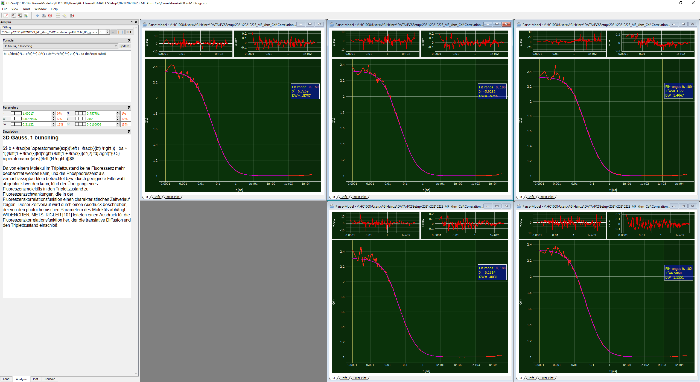

Next, we will link the fits together such that the fit parameter are jointly minimized

For this, first decide for one "parent" dataset, to which all other datasets are pointing. Here, I will simply take curve #1.

Now, switch to the first of your "child" or "dependent" dataset. We will now work with the three checkboxes located between each variable name and variable value:

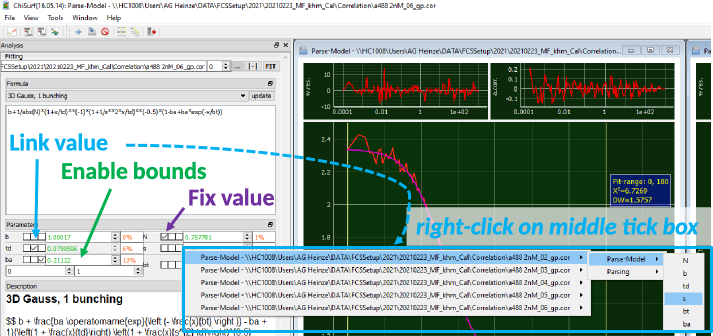

Each tick box has a different function:

Left: fixes the value of the parameter to its current value

Right: Two new parameter fields open, in these ones the lower (left) and upper (right) boundaries for this parameter during the fitting can be defined. An example is to define the allowed fit range for a correlation amplitude to be positive and lie between 0 -1.

Middle: By right-clicking into this tick box a list of all opened fit windows opens. Move your mouse towards the right, as soon as you approach the little arrow, new options appear, move further right on the height of "Parse Model" until the list of fit parameter appears.

From this list of fit parameter select the appropriate one.

For our global fit, we will now link (i) the diffusion time td, (ii) the shape parameter s and (iii) the triplet time constant bt to the first data set:

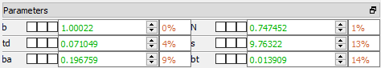

Linked parameter will appear greyed out.

After you are done with the linking, add a new global fit in the "load" tab:

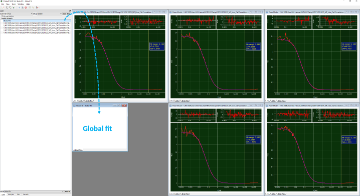

It opens as empty / white window.

Switch back to the analysis tab and add dataset which are to be jointly fitted by clicking firstly on "update" and then on "add".

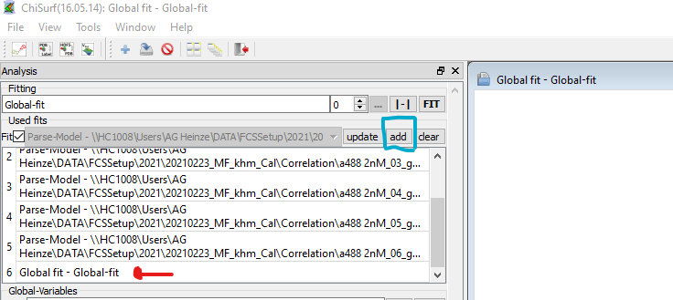

Now a list of all available fit windows appears.

If you want to select which datasets to add, remove the tick behind "fits". Then you can choose from a drop-drown list which datasets are to be included in the global fit.

We need to remove the "global fit" from list ("circular reference"). You do so by simply double-clicking on the item in the list.

Now, press fit and observe what happens.

If you fit many and / or complicated models, the program might take a few moments and display "not responding". This is nothing to worry about and wait until it responds.

Now all datasets have fitted jointly and we obtain the following values:

td = 85.7 µs

s = 5.84

bt = 21.0 µs

ba varies between 0.255 – 0.270

N varies between 0.748 - 0.766

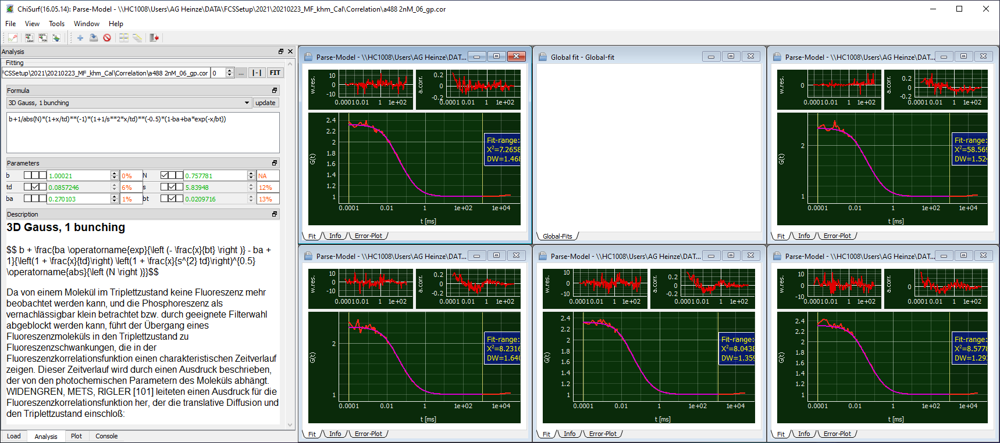

Finally, let's save the fits by either selecting "File"  "Save Fit-results"  "current fit" or by pressing "Ctrl + S".

Caution! Saving all fits may not work, if the filenames are (a) similar and (b) the whole file path is too long. (AutoSaving uses complete path as automatic save name currently).

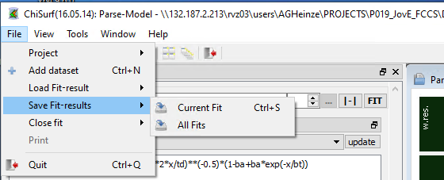

Save the results of all measurements, we will need the fit results in the next step.
