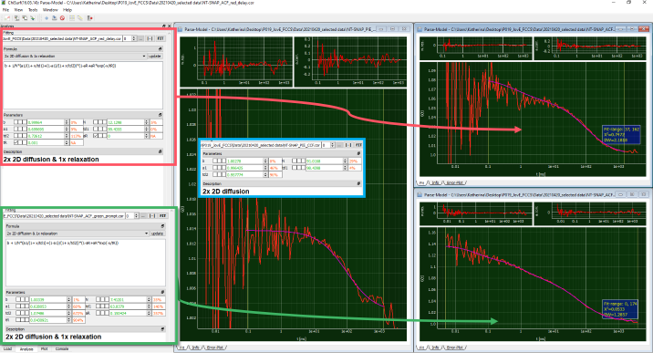

Fit of auto- and cross-correlation curves
^^^^^^^^^^^^^^^^^^^^^^^^^^^^^^^^^^^^^^^^^

Open all three average curves, the green-prompt autocorrelation, red-delay autocorrelation and PIE-cross-correlation curve in ChiSurf. For both autocorrelation curves, we add the fit model with bimodal membrane diffusion and an additional relaxation term. For the PIE-cross-correlation curve, a bimodal membrane diffusion model is sufficient.

For the red autocorrelation and especially the PIE-cross-correlation, the fit ranges have to be adjusted as particularly for short correlation curves the noise is very high and no reliable fit could be acquired here.

