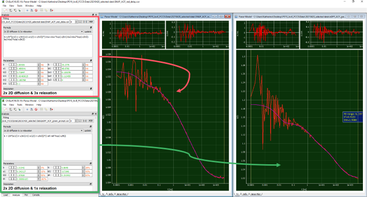
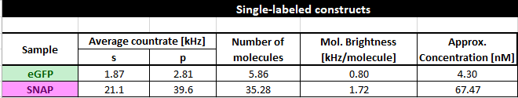

Fit of autocorrelation curves
^^^^^^^^^^^^^^^^^^^^^^^^^^^^^

Open the autocorrelation of the green channels from the prompt time window from the β2AR-eGFP-IL3 measurements and the autocorrelation of the red channels in the delay time window from the CT-SNAP-β2AR measurements in ChiSurf.

Select the bimodal membrane diffusion model for autocorrelation curves, which we have just added to ChiSurf and fit the data:

For average of the β2AR-eGFP-IL3 measurements, a slow diffusion time :emphasis:`tD1` = 118 ms and a fraction of 54 % is obtained. The faster diffusion lies at :emphasis:`tD2` = 1.9 ms. Additionally, 25 % triplet blinking at :emphasis:`tR` ~ 9 µs is observed. However, at this short correlation times the data is already quite noisy and care should be taken in the interpretation. The number of molecules in focus is 5.

For the average of the NT-SNAP-β2AR measurements, two additional relaxation terms seem to be required (modify your JSON-model file accordingly!) with relaxation times (and fractions) of :emphasis:`tR1` ~ 5 µs (12 %) and :emphasis:`tR2` ~ 180 µs (11%). The two diffusion components show times of :emphasis:`tD1` = 49 ms (49 %) and :emphasis:`tD2` = 2.7 ms. The number of molecules in focus lies at 35 and this is much higher compared to β2AR-eGFP-IL3. One could speculate whether :emphasis:`tR2` ~ 180 µs might not be a photophysics-related term but rather unreacted SNAP substrate diffusing through the confocal volume.

Based on the obtained number of molecules in focus and the known average count rates, we can also determine the molecular brightness of our fluorophores in the live cell settings and estimate the concentration of molecules using the equations explained in the calibration section.

Take care to subtract the background signal e.g. measured on non-transfected cells from the average count rate of your fluorescence samples.

