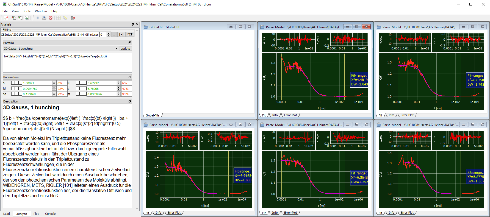

Fit of FCS curve
^^^^^^^^^^^^^^^^

Here, also the "3D Gauss, 1 Bunching" model will be sufficient.

We obtain:

td = 99.5 µs

s = 6.78

N varies between 3.16 – 3.67

Save the fit results and proceed with the calculations as described for the green detection volume.
