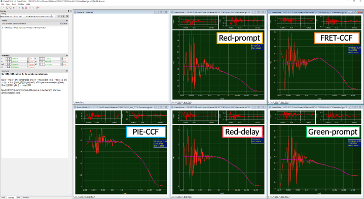

Global fit of auto- and cross-correlation curves
""""""""""""""""""""""""""""""""""""""""""""""""

Before starting ChiSurf, add the fit model for the cross-correlation curve to your JSON-file as described above:

where :emphasis:`aR` and :emphasis:`tR` describe the amplitude and relaxation time of the anticorrelation.

A more general equation – in case of more than one relaxation term – would have the following form:

where :emphasis:`af` describes the total amplitude of the anticorrelation (identical to :emphasis:`aR` in the single anticorrelation term model above) and :emphasis:`aRi` and :emphasis:`tRi` the respective relaxation times and amplitudes.

Load in total five different correlation curves into ChiSurf:

Green-prompt (autocorrelation of green signal in prompt time window)

Red-prompt (autocorrelation of the FRET-induced red signal in the prompt time window)

Red-delay (autocorrelation of the red signal (direct excitation) in the delay time window)

FRET-CCF (cross-correlation of green prompt and red-prompt signal)

PIE-CCF (cross-correlation of green-prompt with red-delay)

The two new curves (red-delay and FRET-CCF), which we have not used to far, both stem from the FRET-induced red signal now present in our data.

Due to the FRET-induced anticorrelated behavior of green and red signal in the prompt time window. The FRET-CCF shows a "dip" at short correlation time, coinciding with a rise in both autocorrelation curves from the prompt time window.

All five loaded curves are fit jointly with linked :emphasis:`tD1`, :emphasis:`tD2` and :emphasis:`tR`. The fit results are summarized in the table below. Please note that here the diffusion times can be fit jointly as the simulation software does not support the modelling of differently sized confocal detection volumes. For experimental results, this joint fitting of :emphasis:`tD` might not be possible, however :emphasis:`tR` should be linked.
