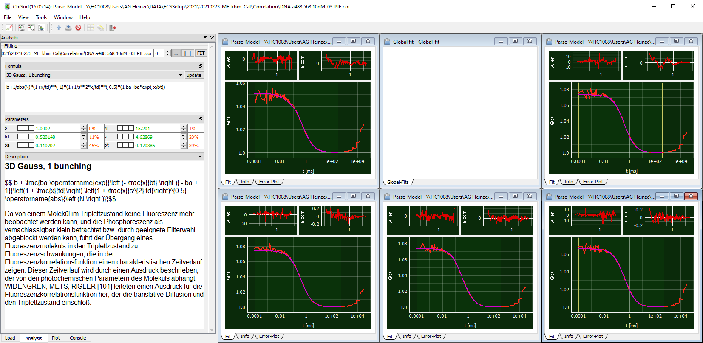

Global fit of FCS curves
^^^^^^^^^^^^^^^^^^^^^^^^

Switch back to ChiSurf2016 and load the following correlation curves form your DNA-sample:

:emphasis:`DNA_gp.cor`: Autocrrelation of green channels in prompt time window

:emphasis:`DNA_rd.cor`: Autocorrelation of red channels in delay time window

:emphasis:`DNA_PIE.cor`: Crosscorrelation of green signal in the prompt time window with  red signal in the delay time window

Add a "3D Gauss, 1 bunching" model to your correlation functions

Of note: theoretically no bunching term should be required as the photophysics from the two fluorophores is independent from each other, and is thus not resulting in a correlating signal.

However, in practice, in case of significant photophysics / triplet blinking and considerable crosstalk as is the case here, we often observed an apparent "photophysics" term, which we model by the relaxation term.

Fix the shape factor :strong:`sgreen` and :strong:`sred` to your determined values from the free dye measurements above.

Remember to adjust your fit range at long lag times if required.

Note: If you have multiple DNA measurements, fit the respective correlation curve from the same correlation channels jointly, i.e. link :strong:`td`, and :strong:`bt` and – for the CCFPIE also :strong:`sPIE`

Observe :strong:`sPIE` in your CCFPIE, it should get a "reasonable" number, usually between :strong:`sgreen` and :strong:`sred`:

Save all fit results, we will need them for our calculations below.

Here, we obtain the following fit results for our DNA samples:

:emphasis:`*sgreen and sred are fixed from the calibration measurements above.`

