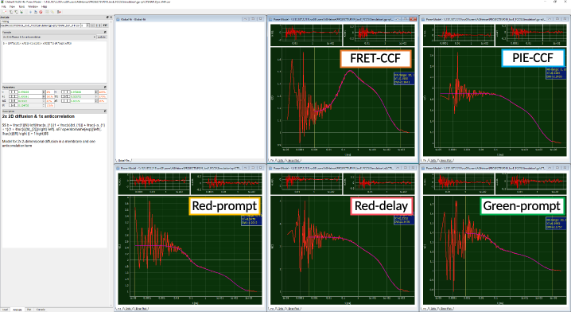

Influence of FRET efficiency
^^^^^^^^^^^^^^^^^^^^^^^^^^^^

The extent of the anticorrelation can be used also as a marker for the extent of change in FRET efficiency :emphasis:`E`: If we change the LF state to :emphasis:`E` = 0 and the HF state to :emphasis:`E` = 0.95, the induced dip in the FRET-CCF is much more pronounced than for the first example.

The amplitude of the anticorrelation has increased to :emphasis:`aR` = 0.66 compared to an :emphasis:`aR` = 0.21 from the previous case.
