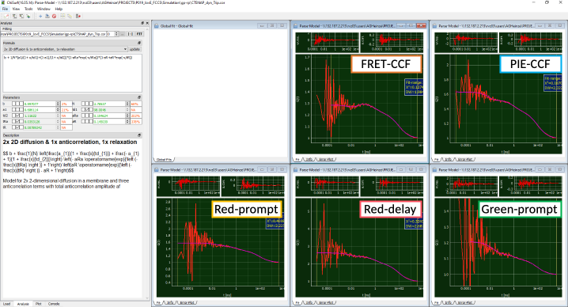

Influence of triplet blinking
^^^^^^^^^^^^^^^^^^^^^^^^^^^^^

Be aware that significant amount of triplet blinking in the µs time range of the donor and / or acceptor fluorophore might mask the anticorrelation induced due to FRET in the FRET-CCF.

In the example shown below, 16 % of additional triplet blinking at 5.5 µs was added to the example of LF(:emphasis:`E` = 0.2) <-> HF(:emphasis:`E` = 0.7).

Here, the FRET-CCF model has to be extended for a triplet-induced correlation term:

where :emphasis:`aT` and :emphasis:`tT` describe the amplitude and relaxation time of the triplet component.

One can see quite nicely in the FRET-CCF how the "dip" in the curve due to the anticorrelation term is counteracted by the triplet component.
