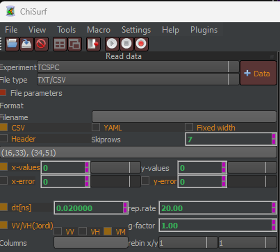

Jordi format
^^^^^^^^^^^^

If both parallel and perpendicular data is saved within the same file and no time axis is defined, the following settings need to be made:

The example data was collected in total 40 MHz PIE mode, i.e. every fluorophore got excited with at 20 MHz, and the data was exported with a time resolution of 20 ps.
