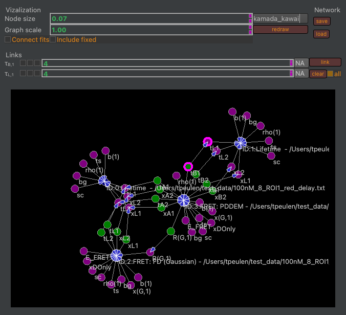

Linking parameters
~~~~~~~~~~~~~~~~~~

Parameters can be selected by clicking on the respective nodes. Selected nodes are highlighted in magenta (:strong:`Fig.36`). The parameters of the selected nodes are displayed in the Links group box (:strong:`Fig.36`). The "link" button creates a link between selected nodes. The clear button removes a link between selected nodes. The "all" checkbox controls if clearing removes the link between selected nodes or the link between all nodes.

:strong:`Fig.36.` Selecting and linking parameters. The parameters "tB1" and "tL1" are selected (highlighted by magenta circles). Selected parameters are displayed in the Link group box. The clear button removes a link between selected parameters. Checking the "all" checkbox before clicking on clear removes all links. The "link" button creates a link between selected parameters.
