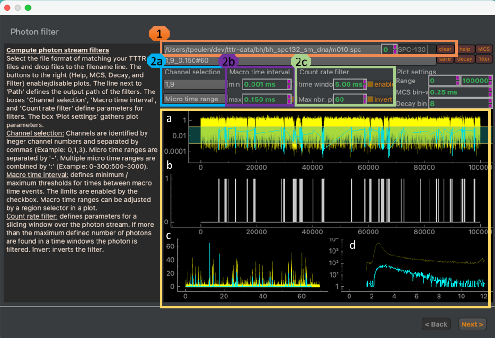

Loading & plotting data
~~~~~~~~~~~~~~~~~~~~~~~

First, the photon stream data needs to be loaded. After opening a new Correlator from the Plugin menu, a new window is presented that allows you to open you photon stream (:strong:`Fig.28`).

:strong:`Fig.28. Data loading and photon filtering.` Line widget, spin box, dropdown menu and clear button to load, select displayed data, select data reading routine, and clearing data, respectively (:strong:`1, orange box`). The help button to the right opens a text box displaying additional information. The MCS, decay, and the filter button enable and disable plots of the intensity trace, the micro time histogram, and the photon mask / filter, respectively. The bottom of the window (yellow box) displays plots of (:strong:`a`) the inter photon time of the raw photon stream (yellow) the selected photons (cyan), (:strong:`b`) the mask used to select the photons, (:strong:`c`) a histogram of the inter-photon time against the time of detection (intensity trace) of all photon in the current file (yellow) and the selected photon (cyan), and a (:strong:`d`) micro time histogram over all photons in the current file and the selected photons in a file. Channels and micro time range selections are entered as lists (:strong:`2a, cyan`). Filters on the inter macro time difference can be enable by checkboxes in the "Macro time interval" group (:strong:`2b, purple`). The filter values correspond to the region selector in section :strong:`a` of the macro time difference plot. Count rate related filter values are adjusted in the green box (:strong:`2c`).

To open files, first, select the reading routing. Next, select files in you preferred file browser (e.g. Windows Explorer, macOS Finder) and drop the selected filed to the text line to the top of the correlator window. After dropping the files to the text line, the files will be loaded into the correlator and the plots in the window will be filled. The loaded data can be cleared by clicking on the "clear" button (:strong:`Fig.28`). The photon selection mask can be saved using the "save" button on the top of the window.
