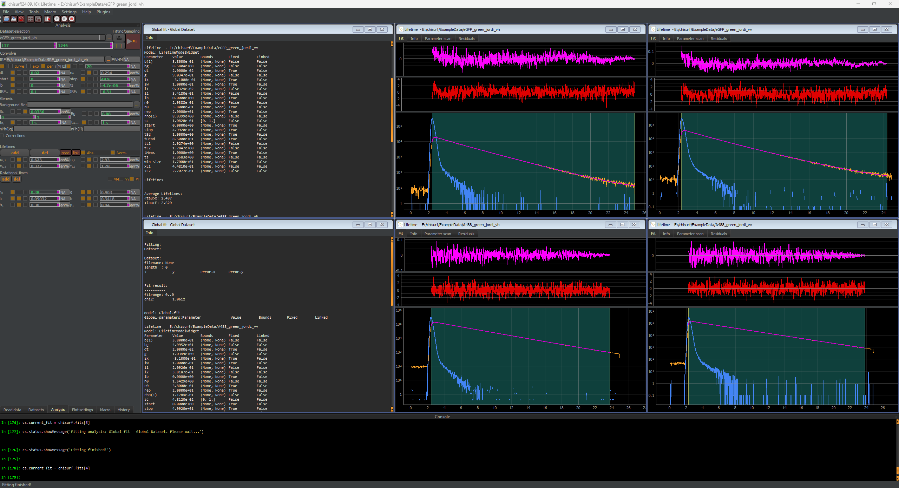

Loading and setting up the eGFP data set
""""""""""""""""""""""""""""""""""""""""

Repeat all steps from above with the eGFP data set. Once completed, six windows should be present in ChiSurf.

Note that as initial parameter for eGFP two lifetimes of 1.3 and 2.6 ns (~ 30:70) should be given, and a single rotational correlation time of 15 ns.
