Loading the Alexa488 data into the anisotropy plugin
""""""""""""""""""""""""""""""""""""""""""""""""""""

After the reading parameter have been correctly set, the anisotropy wizard can be started from the "Plugins" tab:

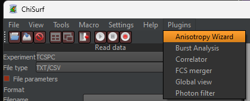

The anisotropy wizard opens in a new window and leads step-by-step through the joint fit setup.

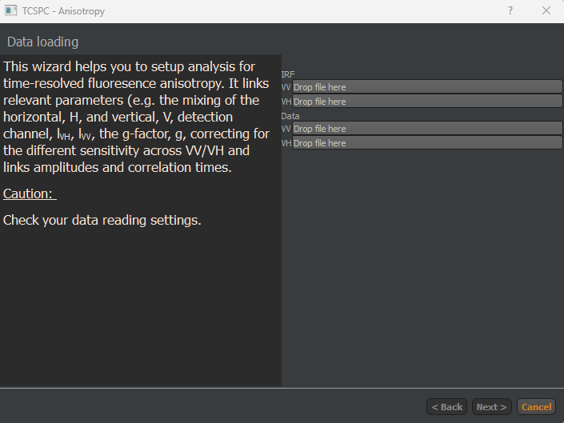

Load the data by "drag'n'drop" the files into the respective boxes. In case the single-file format is used, the still the same file must be loaded twice (The software will automatically load either the parallel or perpendicular section of the data column).

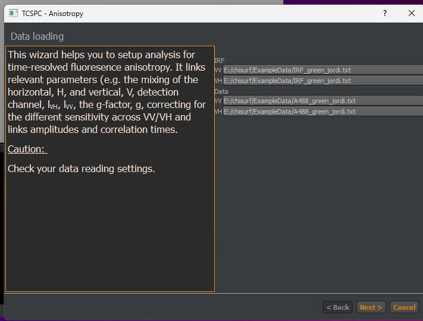

Click "next" to proceed. IN the next step, the IRF background region is defined. Note: The number in the 2nd spin box must always be largr than in the 1st box, i.e. best is to first define the end (here: 100) and then the beginning (here:180)

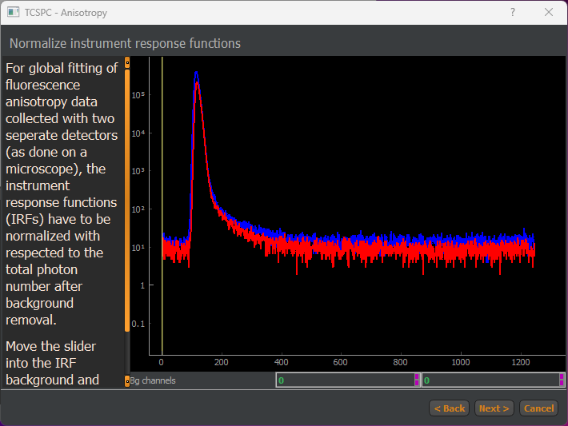

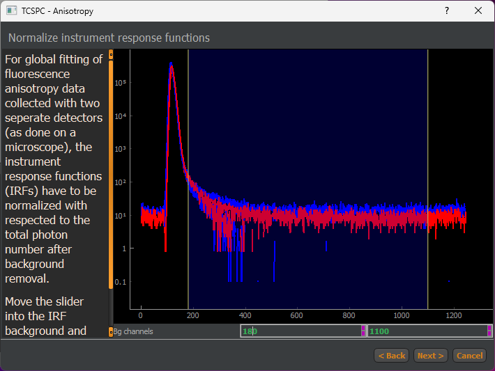

Cleck "next" to proceed. Here, the :emphasis:`g-factor`, :emphasis:`l1` and :emphasis:`l2` can be given (in case known) or estimates can be added.

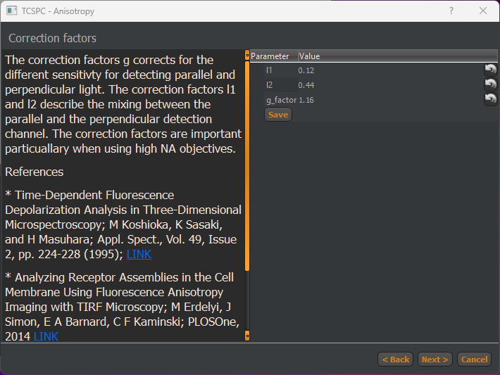

Click "next" to continue. IN this step, the fluorescence lifetimes and rotational correlation times can be added. In this step, settings can also be saved and loaded, e.g. if many similar cells need to be analysed (see also below).

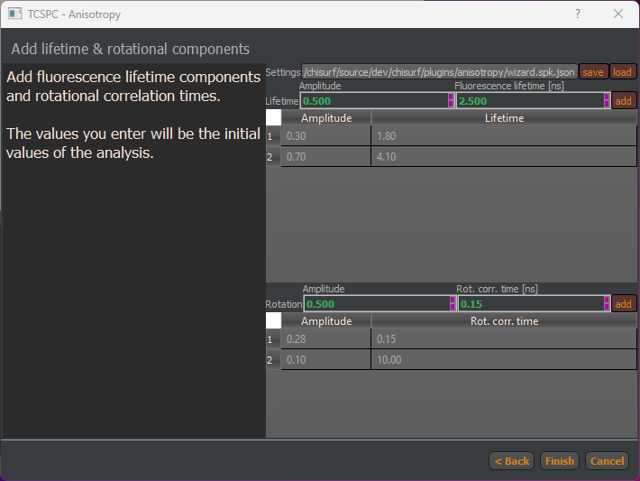

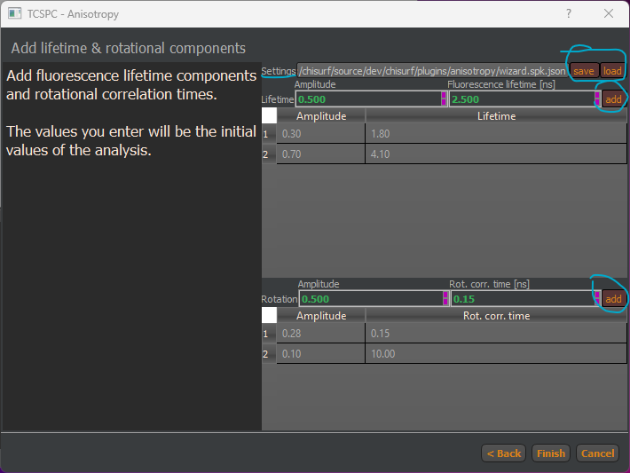

To add a fluorescence lifetime or a rotational component, adjust the values in the box below "Amplitude", "Fluorescence Lifetime" and "Rot. Corr. Time" and press "add".

Components can be removed by double-clicking on the entry in the table.

Please note that the amplitude sum of the fluorescence lifetime components is automatically normalized to 1, while for the anisotropy components the sum is normalized to 0.38, the fundamental anisotropy of most fluorophores.

Click "finish" to generate the joint fits in the main ChiSurf window and press the "tile windows" to distribute the windows in ChiSurf's main window.

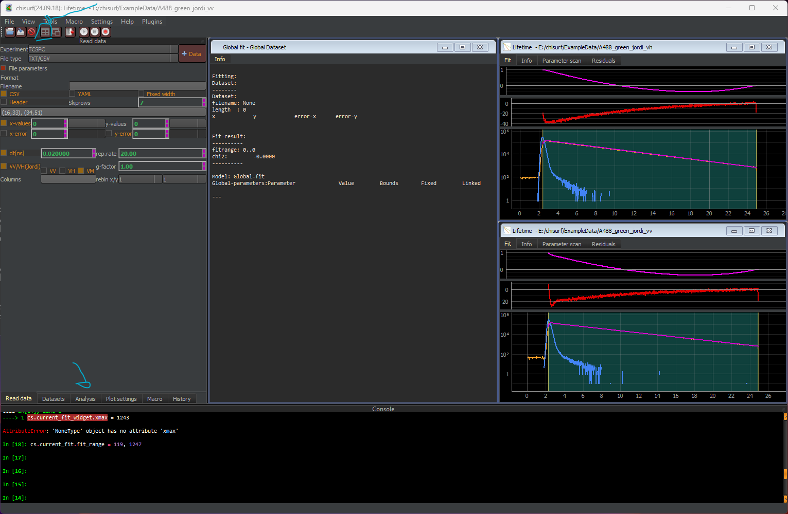

In total, three fit windows are now open. Here, the large window entitled "Global fit" hosts the connections/linking between the two individual fits open in the two smaller windows (here: top contains the perpendicular data, while bottom contains the parallel data).

Next, switch to the "analysis" ta and inspect what is displayed for the three different windows:

#. Global-fit: In the top-part the fits, which are to be minimized jointly are listed, the bottom part could be used to manually link variables across different datasets listed above (not used here).

#. Lifetime - _vh and Lifetime - _vv: Each of them have four different sections:

#. Convolve (top  left to bottom right):

#. Datapath to the IRF

#. Convolution algorithm: e.g. exponential or periodic (selected here)

#. dt: size of a time bin in nanosecond

#. n0: total number of photons in the decay

#. start / stop: start and stop of time range

#. lb: offset of the IRF, must be zero or another small number as we background was already subtracted when setting up the experiment

#. ts: time shift between IRF and decay

#. IRFw/IRFk: In case an IRF cannot be measured/is missing, these parameters can be used to generate a synthetic Gaussian-shaped IRF with width IRFw and skewness IRFk. This option is not when (i) an IRF is loaded and (ii) the parameter are fixed (1st of the three boxes selected)

#. Generic:

#. Sc: fraction of scatter-based fluorescence, should be low in all experiments except signle-molecule

#. Bg: background/offset of the data

#. tBG/tMeas: to be filled when fitting single-molecule in "Burst-Integrated Fluorescence Lifetime" mode

#. Corrections: Ticking this box reveals option to perform a deadtime correction (pulse  pile-up at high count rates) or to correct for differential non-linearities of the counting electronics (white light reference measurement required)

#. Lifetime:

#. xL,[x] are the amplitudes of the fluorescence lifetimes, normalized to a sum of 1 if the "Norm." box is ticked. Amplitudes can also get negative (e.g. for FRET-sensitized acceptor emission data), then the box next to "Abs." must be unticked.

#. τL,[x] are the respective fluorescence lifetime.

#. Rotational times

#. VM - VV - VH: designate the polarization of the dataset

#. r0: fundamental anisotropy of the used fluorophore

#. g: g-factor

#. l1, l2: polarization correction factors

#. b[x]: amplitudes of the rotational correlation times, normalized to r0

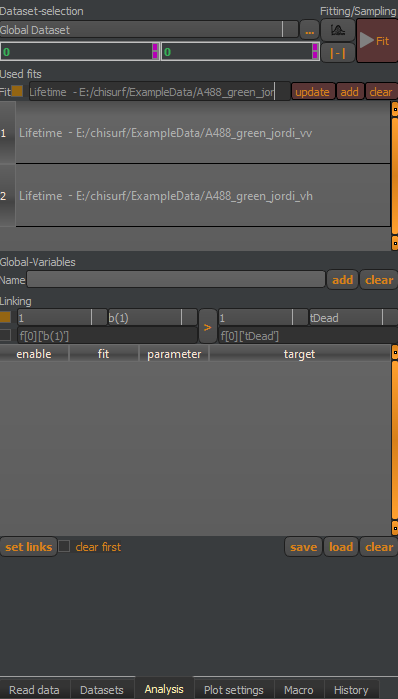

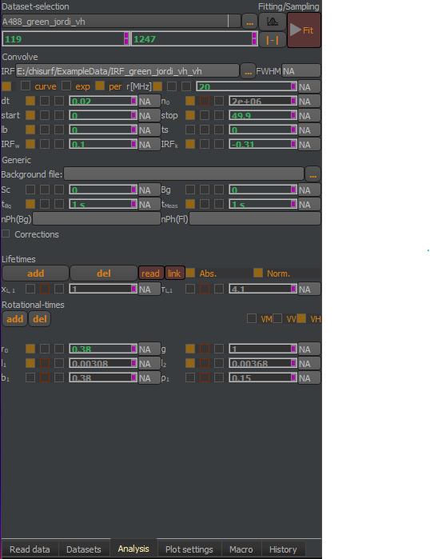

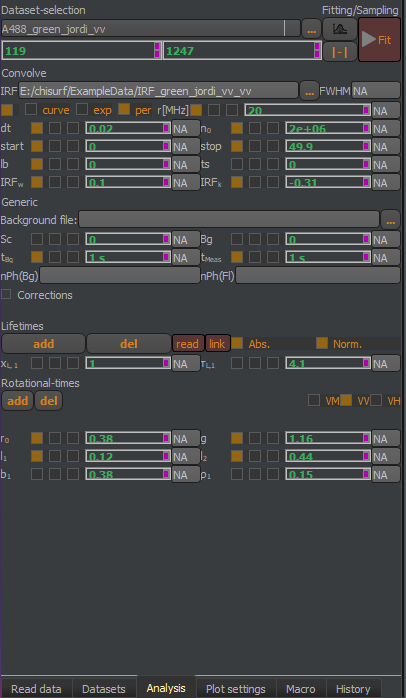

Each of the number-based parameter has three checkboxes:

#. The left checkbox fixes the parameter, it will not be fit but kept constant.

#. The middle checkbox is used to link parameter (via right-click -> link) and if it is filled or shown in read, this means that this parameter has been linked to another data set.

#. The right checkbox can be used to define a range, in which the parameter can float, e.g. a fluorescence lifetime should not become negative.
