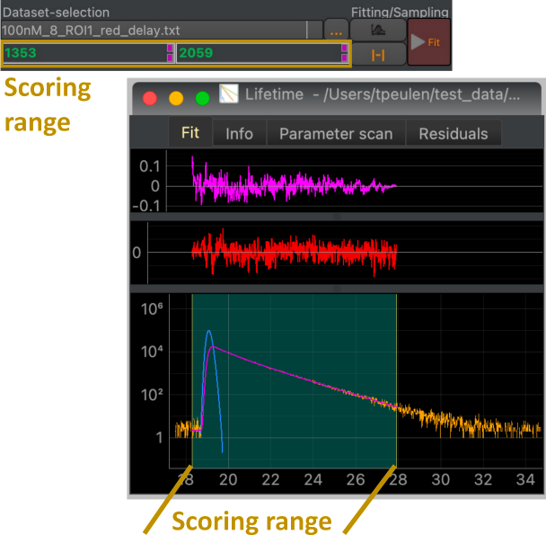

Model scoring range
-------------------

The value of the score depends on the data that is used for scoring. Often, the model is scored in a particular data range. In cases where the data are curves, the scoring range is defined by an upper and lower value (fit range). In the graphical user interface, the scoring range can be adjusted in the 'Data optimization & sampling interface' of in a plot of the data and the model (:strong:`Fig.12`).

:strong:`Fig.12 Adjusting the scoring range.` The scoring range can be adjusted using inputs for the lower and upper bound of the scoring range in the data optimization and sampling interface (top). Alternatively, the scoring range can be adjusted in plots of the data and the model (bottom).

In the programming shell the fit range of the current fit is adjusted using integers as lower and upper bounds that correspond the index of the data.

.. code-block:: python

  fit = cs.current_fit
  fit.fit_range = 61, 649

In this example, 61, 649 is the lower and upper bound, respectively.
