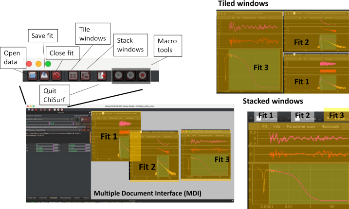

Multiple document interface
---------------------------

The multiple document interface displays fits created using the graphical user interface as windows. When new fits are created in the user interface, corresponding windows will in the MDI, Multi Document Interface (:strong:`Fig.17`). Fit documents in the MDI are windows that can be freely positioned, minimized, and closed. Closing a document closes the corresponding instance of a fit.

:strong:`Fig.17 Elements controlling windows in the multi document interface.` The toolbar in the of a ChiSurf window can be used to open data (with the current data reader), save fits to files, close the currently open fit, tile windows in the multi document interface (MDI), stack windows in the MDI, and to control macros. When windows are tiled, all windows will be displayed in the MDI at once (top right). When windows are stacked a toolbar in the MDI controls which window is currently displayed in the MDI.

Moreover, fit documents can be tiled and stacked in the MDI using the functionality in toolbar (:strong:`Fig.17`). Activating selecting another fit document in the MDI calls:

.. code-block:: python

  cs.current_fit = chisurf.fits[0]

in the shell. In the example, the index "0" refers to the fit in that corresponds to the selected fit window.
