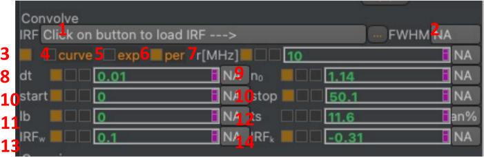
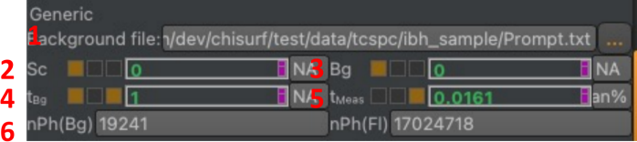
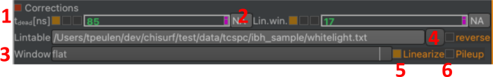

Nuisances
~~~~~~~~~

:emphasis:`Convolution.` In time-resolved fluorescence experiments, usually, the model function is convolved with an instrument response function before comparing the model to the recorded data (iterative (re)convolution). Depending on the experimental conditions and the used model function IRF convolution settings need to be adapted (

:strong:`Fig.20`). Certain convolution settings could be optimized during fitting or varied during sampling. However, usually, the convolution parameters are fixed. Nevertheless, convolution settings can be treated as a variable model parameter.

:strong:`Fig.20 Convolution parameter group box.` \(1) Selection of experimental instrument response function, IRF. If no experimental IRF is selected the convolution uses synthetic (computed) IRF. (2) Full width half maximum of IRF. (3) Enable/disable IRF convolution with model function. (4) use direct convolution of fluorescence decay with IRF (use for parse models). (5) use fast exponential convolution (lifetime models), (6) use fast periodic exponential convolution (lifetime models). (7) repetition rate of laser in MHz (used for periodic convolution). (8) bin width of decay histogram. (9) scaling factor for fluorescence decay (number of photons) if fixed area of model function in fit region is scaled to experimental data (considering the data noise). (10) convolution start/stop. (11) background of instrument response function. (12) time-shift of IRF. (13) width of synthetic IRF. (14) shape-parameter (skewness) of synthetic IRF.

The primary challenge in time-resolved fluorescence experiments lies in the convolution with the instrument response function (IRF). Corrections are necessary to account for periodic excitation, and adjustments to parameters such as convolution start and stop points, as well as scaling of the model fluorescence decay to match the data (optional auto-scaling), are crucial. Incorporating background into the IRF and accounting for time shifts of the IRF further complicate the process. When an experimental IRF is unavailable, a synthetic IRF can be generated, often modeled as a skewed normal distribution. Parameters such as width and skewness of the synthetic IRF can then become free (variable) parameters during fitting and sampling, offering greater flexibility in the analysis process.

:emphasis:`Background.` The background is another significant nuisance in time-resolved fluorescence experiments. The fluorescence intensity is a combination of fluorescence signal and background components. Background can include constant elements, such as afterpulsing over long time scales, as well as other sources like scattered light, which is especially prominent in samples with weak fluorescence and strong scattering. Effectively accounting for background is essential for accurate analysis and interpretation of fluorescence data.

:strong:`Fig.21 Background and generic settings.` \(1) Selection of a background file, (2) scatter pre-factor, (3) constant background offset, (4) background acquisition time, (5) measurement acquisition time, (6) compute number of background and fluorescence photons

Various options exist for modeling the background: (1) incorporating scattering effects into the instrument response function, (2) including a constant offset to account for dark counts, and (3) employing a patterned offset (:strong:`Fig.21`). The acquisition times of both the background file and the experiment are essential, as they influence pile-up corrections. These acquisition times are utilized to compute the number of photons contributed by both the background and the fluorescence. The model used is typically a combination of the background and fluorescence components.

:emphasis:`Additional corrections.` TCSPC data can suffer from pile-up and differential non-linearities, which distort measurements and compromise accuracy. In this context, pile-up refers to the phenomenon where multiple photons arrive within the same time bin, while differential non-linearities, DNL, arise due to the system's response varying the time since the last sync pulse. Systems perturbed by DNLs show correlations for uncorrelated light. Considering these artifacts is crucial for extracting reliable information from TCSPC data.

:strong:`Fig.22 Additional corrections.` Parameters to correct for pile-up and instrumental differential non-linearities, DNL (1) instrument dead-time, (2) window size for smoothing experimental linearization table, (3) window function for computing smoothed linearization table, (4) option to reverse linearization table, (5) option to enable/disable DNL correction, (6) option to enable/disable pile-up correction.

ChiSurf offers options to consider pile-up and DNLs. Instead of modifying the acquired data, the model function is perturbed to preserve the counting statistics for accurate error estimates.
