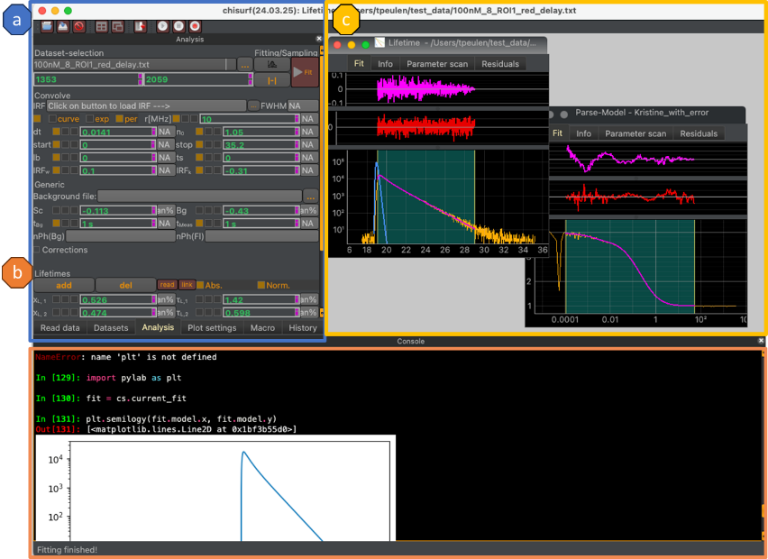
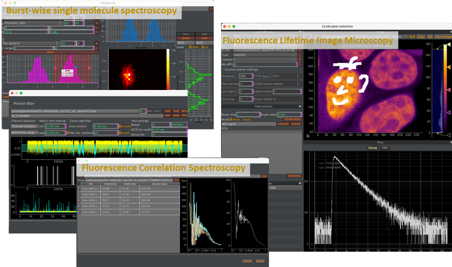
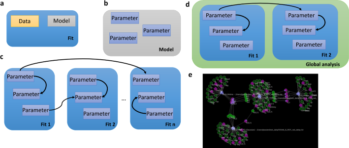

Overview
--------

ChiSurf is modular software for global analysis of fluorescence spectroscopic data. The graphical user interface of Chisurf can be separated into three regions (a) the data reading / analysis dock, (b) a powerful interactive programming shell (an IPython prompt, ) that accesses the currently running ChiSurf instance, and (c) the fitting region that gathers representations and plots of generated models / fits for diverse datasets, such as fluorescence correlation spectroscopy and fluorescence decay histograms (:strong:`Fig.1`).

:strong:`Fig.1 Graphical user interface of ChiSurf.` The dock on the left (a) gathers user interfaces for reading data, creating data analysis, analyzing data, changing plots of created analysis, editing macros, and the history of the current program session. (c) An IPython programming shell interacts with the running ChiSurf session for interactive analysis, programming, and development. (c) Interactive graphical representations of the data facilitate an explorative data analysis that allows for introducing dependencies among datasets of different types for a joint analysis.

Integrated software modules for single-molecule spectroscopy, fluorescence correlation spectroscopy, and image spectroscopy (Fluorescence Lifetime Image Microscopy, FLIM) facilitate the joint analysis of imaging and single-molecule data, while the open Python programming interface allows for integrating other software for complex analysis (

:strong:`Fig.2`). The accompanying software can be used independently of the main analysis software.

:strong:`Fig.2 Accompanying software modules.` ChiSurf is accompanied by software for burst-wise single molecule spectroscopy (ndXplorer), fluorescence correlation spectroscopy (tttrlib), and time-resolve image spectroscopy (clsmview), and additional software for statistical analysis. Historgams over multiparameter fluorescence spectroscopy data and sampled parameters can be computed for sub-ensemble analysis (Burst-wise single molecule spectroscopy). Photon traces can be analyzed for fluorescence correlation spectroscopy, FCS. Data collected on a microscope equipped with time-resolve detection can be processed for FLIM and for pixel-grouped analysis (Fluorescence Lifetime Image Microscopy, FLIM).

The main purpose of ChiSurf is the global analysis over multiple datasets (:strong:`Fig.3`). In ChiSurf this is achied by parameters of models (model parameters) for different data that can be "linked" for a joint/global data analysis. In global analysis multiple datasets are simultaneously described and dependencies of parameters across different datasets are exploited to maximize the accuracy and the precision of the analysis result, which can either be a point estimate determined by maximizing the agreement between the model and the data the variable parameters by fitting or by sampling over the variable parameters.

:strong:`Fig.3 Global analysis in ChiSurf. (a)` In ChiSurf data and models are combined to "Fits". (:strong:`b`) Each model has a set of parameters, which can be either a fixed parameter or a variable parameter. (:strong:`c`) The parameters of different "Fits" can be linked to introduce dependencies. (:strong:`d`) In a global analysis multiple fits with corresponding data and parameter dependencies are jointly analyzed, either by optimizing a scoring function or by sampling over the parameters. (:strong:`e`) Parameter dependency of a fluorescence decay analysis of the donor fluorescence decay in the presence and the absence of an acceptor, the direct excited acceptor, and the FRET sensitized acceptor. Parameter dependencies are visualized in a network graph.

This introduction gives a general overview and background information without providing specific information on how to use the software in particular use-cases for data analysis. The "Experiments" section provides specific information for experiments. The tutorial section at the end of this manual provides guides on how to use the software in particular use-cases. Code references are printed in a bold monospaced slab serif typeface, e.g., :strong:`Example`. This introduction provides background information and is best combined with a tutorial.
