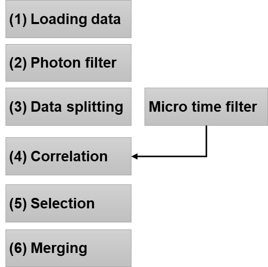

Overview
~~~~~~~~

The Correlator Plugin of ChiSurf provides an interactive user interface to functionality implemented in tttrlib () to process single photon counting data and compute correlation curves following a 6 step workflow outlined in :strong:`Fig.27.` The correlator plugin is opened from the ChiSurf plugin menu (Plugins  Correlator).

:strong:`Fig.27 Workflow to compute fluorescence correlation spectroscopy curves`. The loaded single photon counting, (1) :strong:`Data loading`, is filtered, :strong:`(2) Photon filter`, to select certain regions of the photon stream. For estimating uncertainties, the photon stream is separated into subsets, :strong:`(3) Data splitting`, and subsets of are correlated, :strong:`(4) Correlation`. To minimize artifacts correlation curves are visualized and selected, :strong:`(5) Selection`. Finally, a correlation curve is with associated uncertainties is computed, :strong:`(6) Merging`.

The workflow can be used to compute simple correlations and allows for more advanced filtering methods to enhance the contrast in fluorescence cross correlation spectroscopy, FCCS, and minimize artifacts. In the first step, the raw photon stream is opened. In the second step, filters are applied to the photon stream to mask photons that do not fulfil certain conditions, e.g., photons in regions of the stream where the count rate exceeds a certain threshold. In the third step, the selected / filtered photon stream in split into subsets. In the next fourth step, the subsets are individually correlated (optionally with a micro time filtered, e.g., for lifetime filtered correlation). Following the correlation, correlation curves are inspected and selected in the fifth step. To be finally merged into a joint correlation curve (:strong:`Fig.27`, Step 6, Merging).
