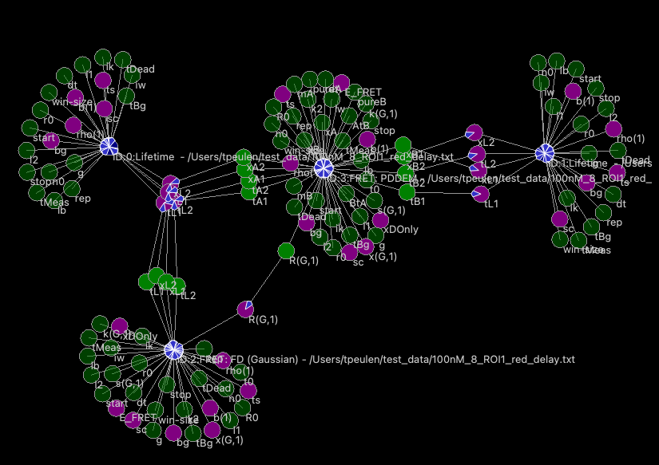
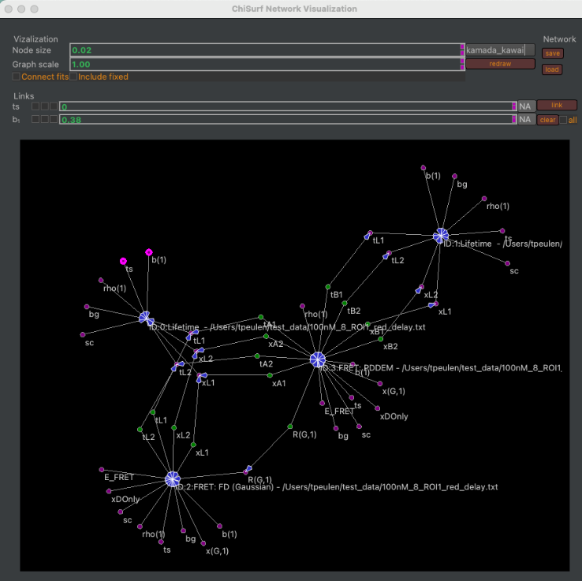

Overview
~~~~~~~~

In ChiSurf dependencies between parameters can be introduced by linking and visualized in graphs (:strong:`Fig.31`). The :emphasis:`Global view` plugin (:emphasis:`i`) visualizes parameter dependencies in directed graphs, (:emphasis:`ii`) saves parameter dependencies, and (:emphasis:`iii`) restores dependencies from files.

:strong:`Fig.31. Parameter dependency graph in time-resolved fluorescence decay analysis.` Fluorescence decays, , that describe the donor fluorescence in the absence of an acceptor in a donor only, , the donor fluorescence the presence of an acceptor, , the acceptor fluorescence in a FRET sample , and the FRET sensitized acceptor fluorescence, . Parameters and models are represented by circles. Dependencies are illustrated by arrows. Parameters dependent on other parameters are colored in green. Fixed parameters are displayed in light green. Variable parameters are highlighted in magenta.

The :emphasis:`Global view` plugin opens from the Plugin menu, Plugins → Global view, in a separate window (:strong:`Fig.32`).

:strong:`Fig.32.` User interface of the :emphasis:`Global view` plugin. The plugin represents models and parameters in graphs (bottom). The Visualization group box of the plugin gathers options controlling the graph visualization (Node size, Graph scale). The Network group box can be used to save and load dependencies. The Link group box can be used to introduce and delete (clear) dependencies across selected and all parameters.
