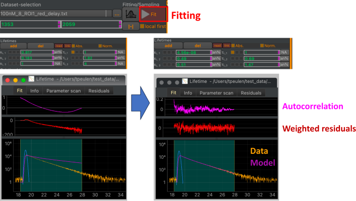

Parameter optimization
----------------------

ChiSurf uses the lmdif and the lmder algorithm implemented in MINPACK to optimize variable parameters. Variable parameters are optimized either by clicking on the 'Fit' button in the data optimization and sampling interface (:strong:`Fig.13`) or using the shell:

.. code-block:: python

  fit = cs.current_fit
  fit.run()

Grouped fits offer the option to first optimize local variable parameters before optimizing the global fit.

.. code-block:: python

  fit = cs.current_fit
  fit.run(local_first=True)

The effect of optimizing (fitting) variable model parameters to data for a fluorescence decay curve are displayed in :strong:`Fig.13`.

:strong:`Fig.13 Optimizing variable parameters.` The Fit button (red box) optimizes the agreement between the model and the data. The middle panels display fixed and variable model parameters before and after fitting (clicking the 'Fit' button). The bottom displays the data and the model before and after fitting. The autocorrelation of the weighted deviations between the data and the model weighted by the data noise (weighted residuals) and the weighted residuals visually captures the similarity between the data and the model.

.. code-block:: none

  Parameters of the optimization algorithms can be defined in the optimization section of the ChiSurf settings file (optimization:
  global_threaded_model_update: false
  global_optimize_local_first: false
  leastsq:
  ftol: 1.49012e-08
  xtol: 1.49012e-08
  gtol: 0
  maxfev: 0
  epsfcn: 0
  factor: 100
  full_output: true
  mem:
  lower_bound: 1.0e-08
  upper_bound: 10000000
  maxiter: 150000
  maxfun: 1500000
  factr: 10
  reg_scale: 1
  sampling:
  method: emcee
  steps: 1000
  thin: 1
  chi2max: 1000000000
  n_runs: 10

:strong:`Fig.14`).

.. code-block:: none

  optimization:
  global_threaded_model_update: false
  global_optimize_local_first: false
  leastsq:
  ftol: 1.49012e-08
  xtol: 1.49012e-08
  gtol: 0
  maxfev: 0
  epsfcn: 0
  factor: 100
  full_output: true
  mem:
  lower_bound: 1.0e-08
  upper_bound: 10000000
  maxiter: 150000
  maxfun: 1500000
  factr: 10
  reg_scale: 1
  sampling:
  method: emcee
  steps: 1000
  thin: 1
  chi2max: 1000000000
  n_runs: 10

:strong:`Fig.14 Optimization section in settings file.` Optimization parameters for the optimization alogrithms are gathered in the optimization section of the ChiSurf settings file.

The ChiSurf settings file is described in more detail in :strong:`Section 4`.
