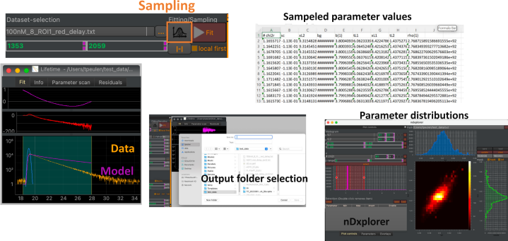

Parameter sampling
------------------

ChiSurf uses emcee to efficiently sample over free model parameters. The sampling over the free model parameters can initiated using the "Distribution" button next to the "Fit" button in the fitting and optimization interface (:strong:`Fig.15`).

:strong:`Fig.15 Sampling over variable model parameters illustrated for time-resolved fluorescence analysis.` Data and model of a fit are displayed below. Clicking on the sampling button (highlighted in orange) initiates the sampling over the free model parameters and opens a folder selection menu (bottom). During the sampling ChiSurf will become inactive and create output files (txt files) containing the sampled model parameters. The outputted files can be opened in tools for multidimensional histograms such as nDxplorer (part of ChiSurf) or Margarita (Seidel software) to visualize distributions of the sampled parameters (bottom right).

The settings controlling the sampling, such as the number the number of steps, are located setup in the "sampling" section of the ChiSurf settings file (:strong:`Fig.14`).

The sampling can also be initiated from the shell. Variable parameters of the currently active fit are sampled as follows:

.. code-block:: python

  fit = cs.current_fit
  chisurf.fitting.fit.sample_fit(fit, filename="/output_path/outfile.er4")

The settings of the sampling from the shell can be adjusted using the parameters of the sample_fit function (:strong:`Fig.16`).

.. code-block:: none

  def sample_fit(
  fit: Fit,
  filename: str,
  method: str = 'emcee',
  steps: int = 1000,
  thin: int = 1,
  chi2max: float = float("inf"),
  n_runs: int = 10,
  step_size: float = 0.1,
  temp: float = 1.0,
  **kwargs
  )

:strong:`Fig.16 Definition of the sample fit sample function.` The function can be used for sampling over variable fit parameters.

Note, for an accurate analysis the sampling must be as complete as possible. For complex high dimensional models, the number of steps must be adjusted.
