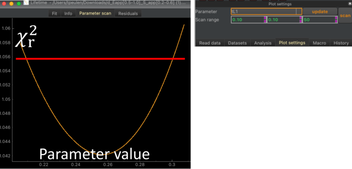

Parameter scan
--------------

A Chi Square support plane analysis around the minimum (the fitted solution) can be performed in in fits/model that offer a "Parameter scan". In the parameter scan a free model parameter can be selected from a dropdown menu. The selected parameter is varied in a defined range. Other free model parameters are optimized.

:strong:`Fig.19 Parameter scan plots` are offered by fits of certain models. The parameter scan varies a parameter in a certain range (top) and optimizes other free model parameters to create a  curve that depends on the parameter (bottom). The resulting  curve can be used to estimate uncertainties of model parameters. Red line chi2 confidence level 95% computed with F-Calculator.

This procedure (Support plane analysis) produces a  curve of the scanned parameter that can be used to estimate uncertainties (:strong:`Fig.19`). Upper limits of  can be computed using the F-Calculator tool (see Section 5.1, page 24).

Reduced Chi Square
