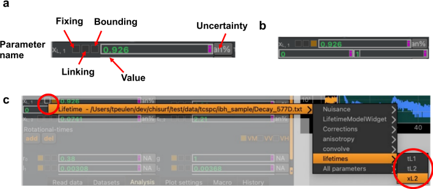

Parameters
----------

A key attribute of parameters is their value. Parameter values are either fixed or variable floating-point numbers. Parameters can be part of a model. Variable parameters associated to a model instance are varied during model fitting/optimization and model sampling. A parameter can be bounded to restrict its range during sampling/optimization. An instance of a parameter can be connected (linked) to another parameter instance (:strong:`Fig.10`). A parameter that is linked to another parameter will report the value of the other parameter as its own value. This allows to introduce dependencies across different model instances.

:strong:`Fig.10 Fitting parameter. (a)` Fitting parameters have a name (parameter name), can be free (variable parameter) or fixed (fixed parameter), can be linked to other parameters, bounded in region, and can have an optional uncertainty associated to them. The checkboxes next to the parameter name can be used to fix, link, bound parameters. (:strong:`b`) Bounded parameters display the lower and the upper value of the parameter below. (:strong:`c`) Parameters can be linked to other parameters using the context menu of the linking checkbox. The context menu (accessed by a right click) displays the created fits in the ChiSurf instance. The submenus of the context menu display parameter groups and parameters (red circle to the right).

Parameter values are by modifying the parameter value displayed in the user interface (:strong:`Fig.10`, :strong:`a`). Parameters are fixed using the first checkbox of the graphical parameter control interface (:strong:`Fig.10`, :strong:`a`). The second checkbox allows to link a parameter to another parameter. The second checkbox from the left and its tooltip report on the linking state of a parameter (:strong:`Fig.10`, :strong:`a`). The third checkbox from the left enables parameter bounds (:strong:`Fig.10`, :strong:`a, b`).

Actions in the user interface on parameters can be called from the shell. In the ChiSurf shell script below, two parameters are created, values are assigned to the respective parameters, and parameters are linked to each other, to illustrate how to create and interact with parameters.

.. code-block:: python

  p1 = chisurf.parameter.Parameter(name='p1', value=0)
  p2 = chisurf.parameter.Parameter(name='p2', value=0)
  p1.value = 1
  p2.value = 2
  p1.link = p2
  p1.value == 2 # True

Links are removed by assigning None to a link attribute.

.. code-block:: python

  p1.link = None
  p1.value == 1 # True

The variable parameters of the current fit model are accessed using the parameter_dict attribute.

.. code-block:: python

  cs.current_fit.model
  cs.current_fit.model.parameter_dict

All parameters (fixed & variable) of the current fit model are accessed using the parameters_all_dict attribute.

.. code-block:: python

  cs.current_fit.model.parameters_all_dict

Parameter bounds can be enabled, assigned and disabled in the shell by setting the bounds_on attribute and assigning upper and lower bounds. Here, is an example for the parameter named 'sc'.

.. code-block:: python

  chisurf.fits[0].model.parameters_all_dict['sc'].bounds_on = True
  chisurf.fits[0].model.parameters_all_dict['sc'].bounds = (0.0, 1.0)
  chisurf.fits[0].model.parameters_all_dict['sc'].bounds_on = False

Parameters can be fixed and made variable parameter as follows:

.. code-block:: python

  chisurf.fits[0].model.parameters_all_dict['sc'].fixed = True
  chisurf.fits[0].model.parameters_all_dict['sc'].fixed = False

Fixed parameters are not varied during fitting and sampling.
