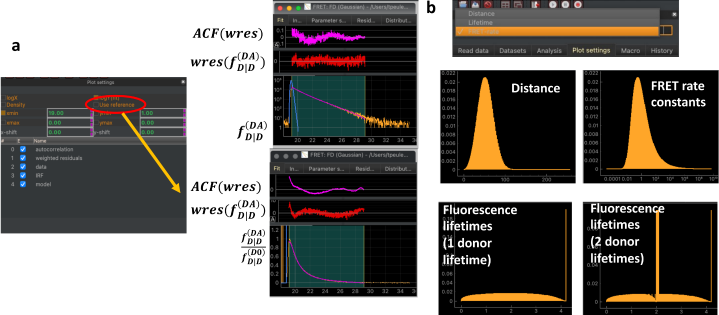

Reference curves
""""""""""""""""

:strong:`Fig.24 FRET model fit plots.` (a) Fluorescence decays of the donor in the presence of an acceptor, , can be plotted using the fluorescence decay of the donor in the absence of an acceptor, , as a reference to compute the FRET induced donor decay, . Enabling the "Use reference" checkbox displays the ratio . (b) FRET models can be displayed as distance distribution, FRET rate constant distribution of as fluorescence lifetime distribution. Fluorescence lifetime distributions can adopt more complex shapes for multi exponential donor fluorophores.

The "Use reference curve" option in the plot settings of a FRET model (see :strong:`Fig.18` & :strong:`Fig.24`).
