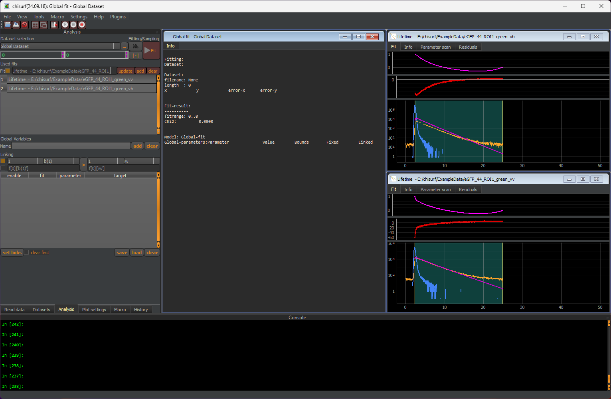
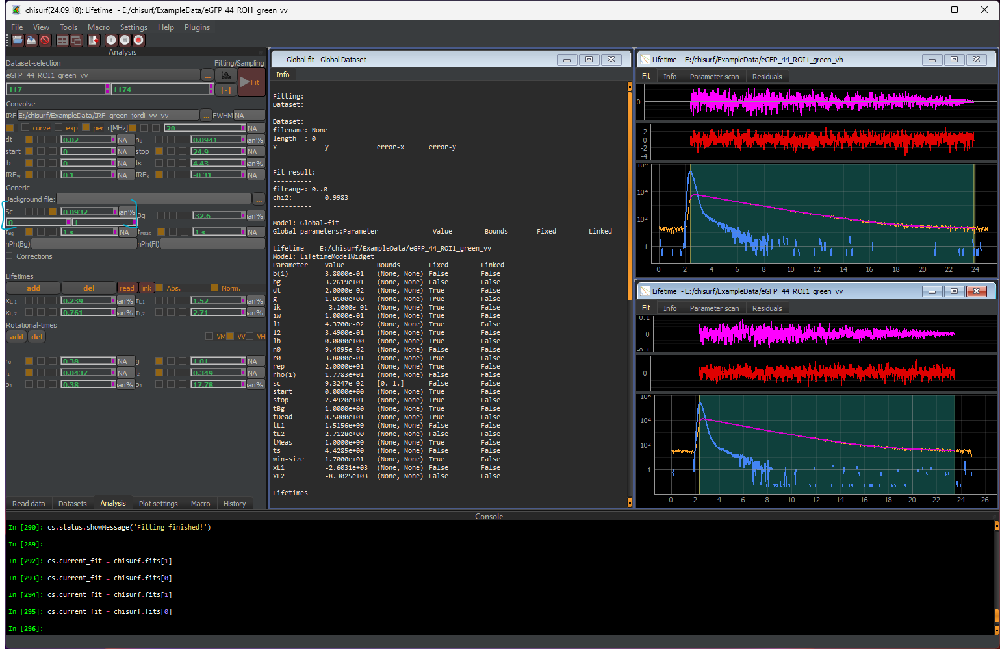

Re-using the parameter to analyse the actual samples
""""""""""""""""""""""""""""""""""""""""""""""""""""

The obtained parameter can now be used to analyse the actual cell samples. Here, the example data stems from HEK293T cell transfected with cytosolic eGFP.

Firstly, verify that the reading parameter are still set correctly. Next, open the anisotropy wizard and load the cell data.

In the correction factor window, enter the obtained values and press save. In the fluorescence lifetimes and rotational correlation times window, the following components are given:

#. Fluorescence Lifetime: 2.6 ns / 1.6 ns (0.7, 0.3)

#. Rotational correlation times: 10 ns (0.38)

If the estimated parameter given in the fit setup are sufficiently close, one can directly proceed to the global fit window and press "Fit".

Attention! Verify that no negative scatter fraction is present. Short-lived scatter might often e mixed up with fast rotational components.

Here we obtain an average eGFP lifetime of 2.44 ns and a rotational component of 17.8 ns.
