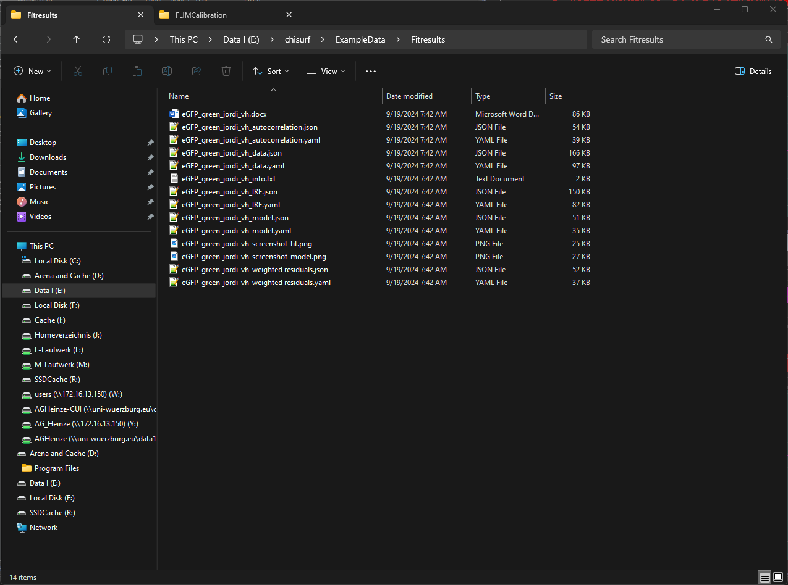

Saving & exporting the results
""""""""""""""""""""""""""""""

To save the results, either click on the respective fit window and press "Ctrl+S" or select from the main toobar at the top "File" -> "Save Fit results" -> "Current Fit".

For each fit in total 14 files are saved:

#. The word-file summarizes the results in a table.

#. The :emphasis:`json` and :emphasis:`yaml` files are required to open the fit results again in ChiSurf.

#. The wo png files are screen shots of the fit window and analysis window.

#. The Info.txt summarizes the fit results table-like in a txt file.
