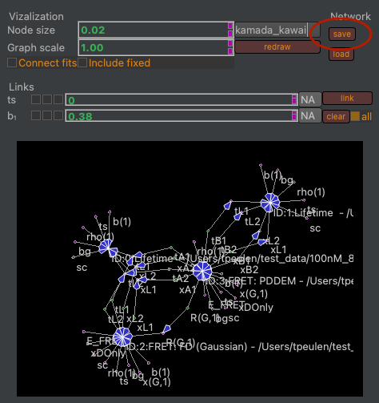
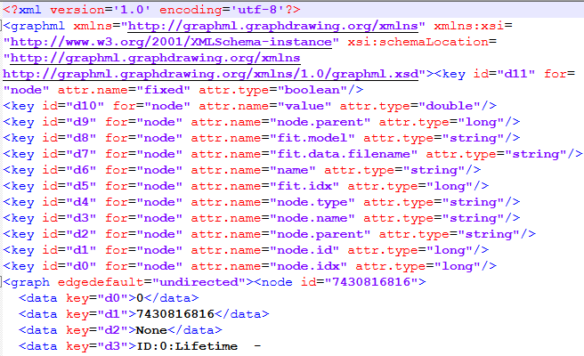
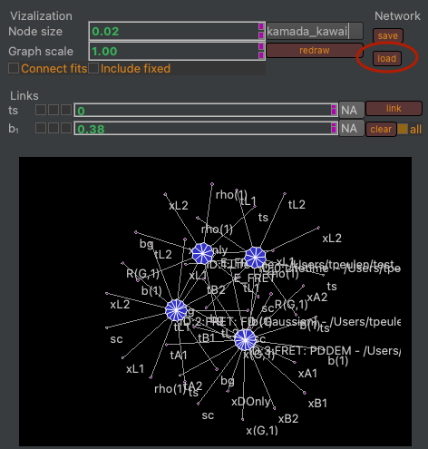
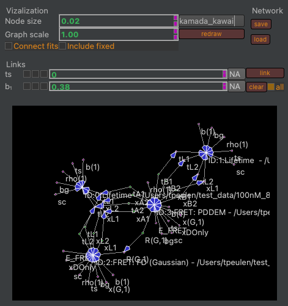

Saving and loading networks
~~~~~~~~~~~~~~~~~~~~~~~~~~~

By default, the Global view plugin displays all models / fits in the current ChiSurf instance. Parameter networks can be saved using the save button (:strong:`Fig.34`).

:strong:`Fig.34.` Saving parameter dependency networks (left). Parameter dependency networks are saved in GraphML files (right).

ChiSurf stores fits in an ordered list. Hence, when loading networks file the fits in the saved network must match the order of the fits in the running ChiSurf instance. After loading a GraphML file containing the parameter links the values of the parameter and their connections are restored (:strong:`Fig.35`).

:strong:`Fig.35.` Loading parameter values and connections (left). After loading a matching GraphML file the dependencies between parameters are restored (right).
