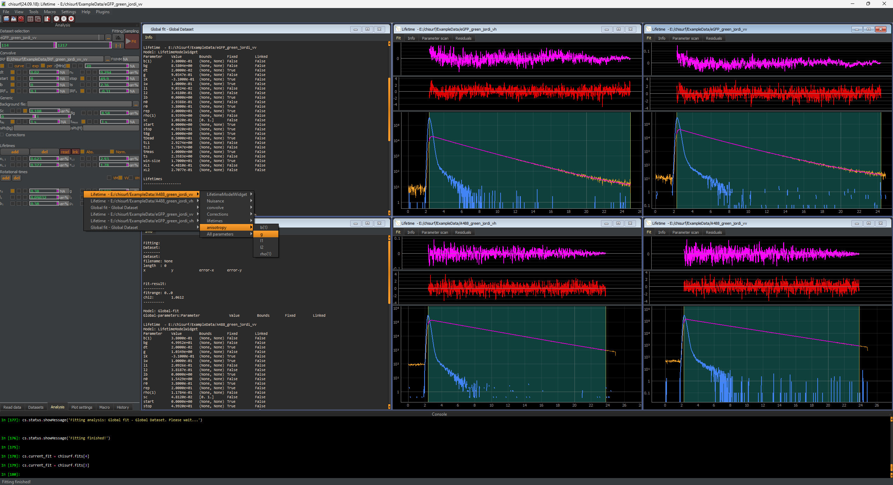
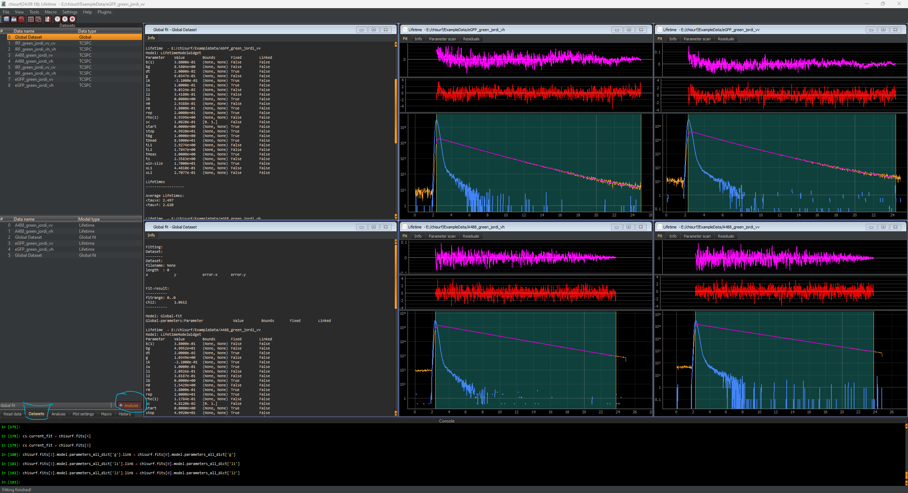
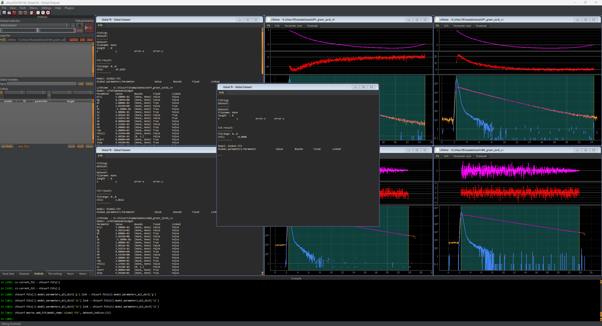
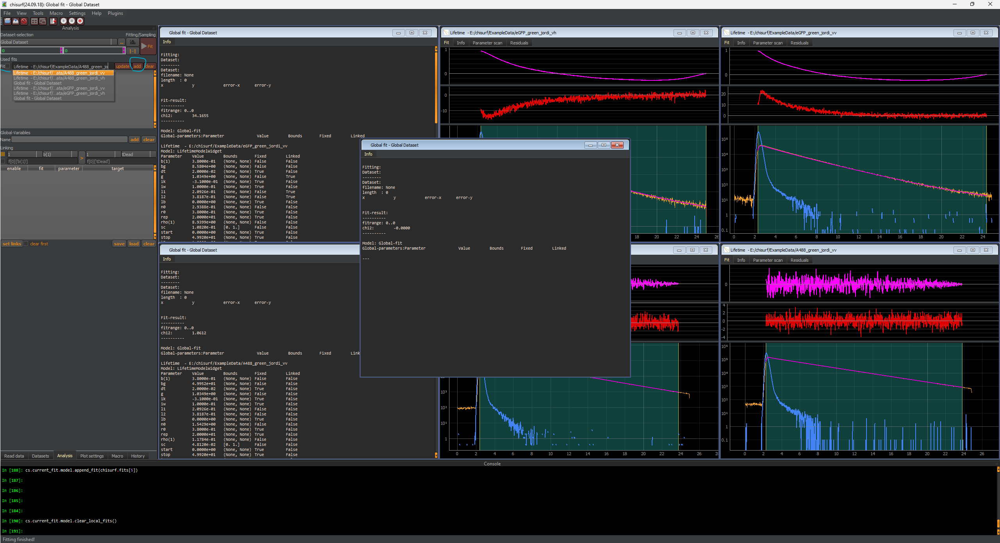
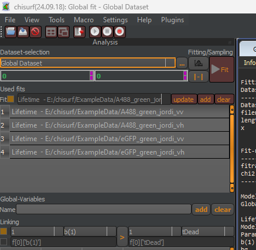
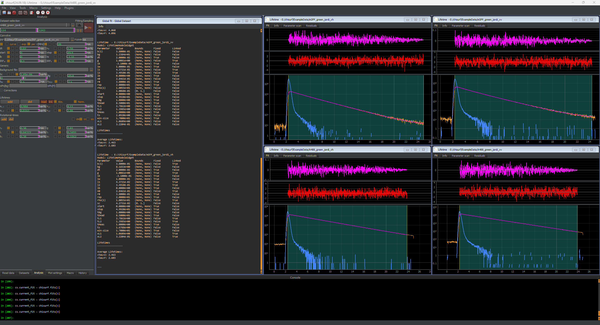

Setting up the joint global fit of A488 & eGFP
""""""""""""""""""""""""""""""""""""""""""""""

In the next step, a joint global fit of all four data sets (A488 VV, A488 VH, eGFP VV and eGFP VH) will be performed to best estimate the g-factor and the polarization correction factors.

Firstly, the :emphasis:`g-factor`, :emphasis:`l1` and :emphasis:`l2` from eGFP VV will be linked to the respective parameter from A488 VV. Note these parameters in A488 VH and eGFP VH are already linked to the respective VV dataset, A488 VV or eGFP VV.

Next, a new global fit is added. Switch to the "Datasets" tab, select "Global Dataset" and press the "+ Analysis" button.

A new window will open.

Switch back to the analysis tap and add the four relevant datasets for the joint fit to the global analysis by using the drop-down menu and the "add" button in the top left.

All four datasets need to be added:

#. A488 VV

#. A488 VH

#. eGFP VV

#. eGFP VH

Do not add the previous global fits!

Finally, press the fit button and obtain the estimates for the g-factor and the polarization correction factor based on both data sets. Here, the following values are obtained:

#. g-factor = 1.01

#. l1 = 0.0437

#. l2 = 0.349

:emphasis:`@Elizabeth: We have observed that the depolarization in one polarization direction is much larger in our used 40X/NA1.2 Zeiss water objective. This might be different for other objectives.`

