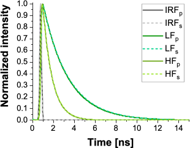
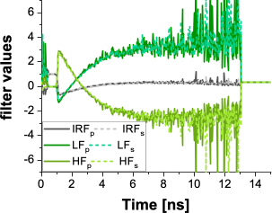
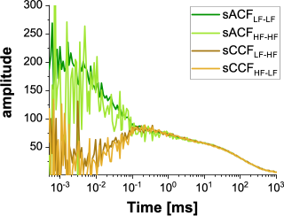
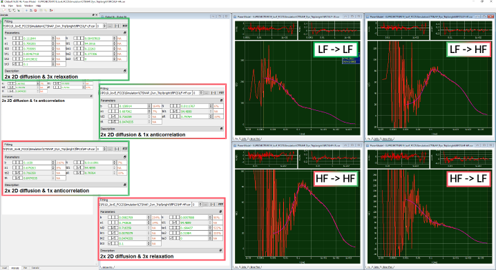

Species-filtered FCS to recover dynamics
""""""""""""""""""""""""""""""""""""""""

A method to recover the triplet-masked anticorrelations in the FRET-CCF is to make use of the microtimes (i.e. the fluorescence decay histograms) encoded in the data. Here, instead of direct photon traces, an additional weighting function is introduced based on the fluorescence decay shape of the (i) IRF, (ii) the LF state, and (iii) the HF state. More details on how to generate these weighting functions can be found e.g. in the following literature 6,7.

In this species-specific or filtered FCS approach, four different correlation pattern are generated:

Species-autocorrelation of the LF state (:emphasis:`sACFLF-LF`)

Species-autocorrelation of the HF state (:emphasis:`sACFHF-HF`)

Species-cross-correlation of the LF state to the HF state (:emphasis:`sCCFLF-HF`)

Species-cross-correlation of the HF state to the LF state (:emphasis:`sCCFHF-LF`)

Below, exemplary the work flow and input for a filteredFCS analysis of the LF(:emphasis:`E` = 0.2) <-> HF(:emphasis:`E` = 0.7) example with additional triplet is shown.

:emphasis:`Note: Suffix "p" and "s" are used to discriminate between the parallel (p) and perpendicular (s) channel here.`

For generation of the species-filtered FCS curves, the weights determined for the LF and HF species based on the normalized intensity decays are used during the correlation.

The resulting curves are fit to standard equations with bimodal membrane diffusion and relaxation and anticorrelation terms, respectively.

During the fit, both diffusion times :emphasis:`tD1` and :emphasis:`tD2` as well as the relaxation times are fit jointly and the FRET-induced relaxation of the :emphasis:`sACFLF-LF` and :emphasis:`sACFHF-HF` is linked to the anticorrelation term of the :emphasis:`sCCFLF-HF` and :emphasis:`sCCFHF-LF`.

:emphasis:`Be aware that the number of molecules in focus, N, is only an apparent number and does no longer relate to the concentration of molecules in the experiment / simulations!`
