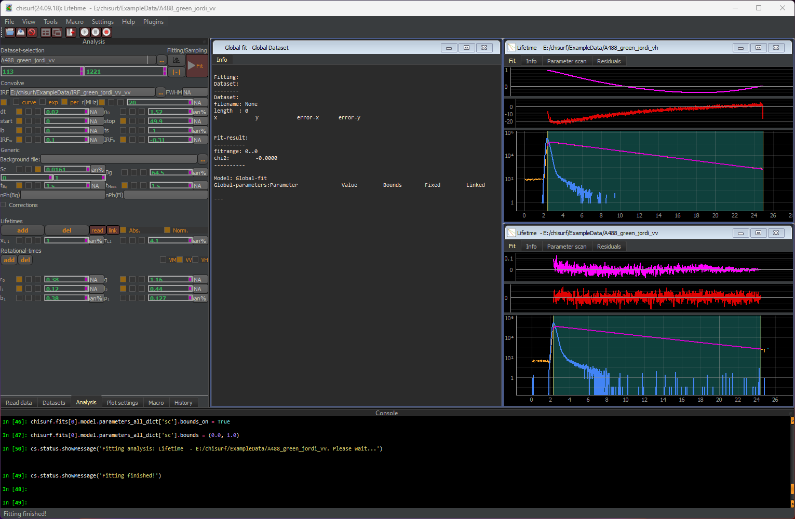

Step 1: Approximating g-factor with small fluorophore
"""""""""""""""""""""""""""""""""""""""""""""""""""""

To start the analysis, first go to the "VV" dataset and perform a quick, individual fit of this dataset. This helps to set at least the time shifts between IRF and decay of the background/offset correctly.

In this step, still the g-factor, l1 and l2 are fixed to the initially estimated values. Next, also perform a quick fit on the VH dataset. Important note: The fit will not be good! This only serves to initialize the parameter.
