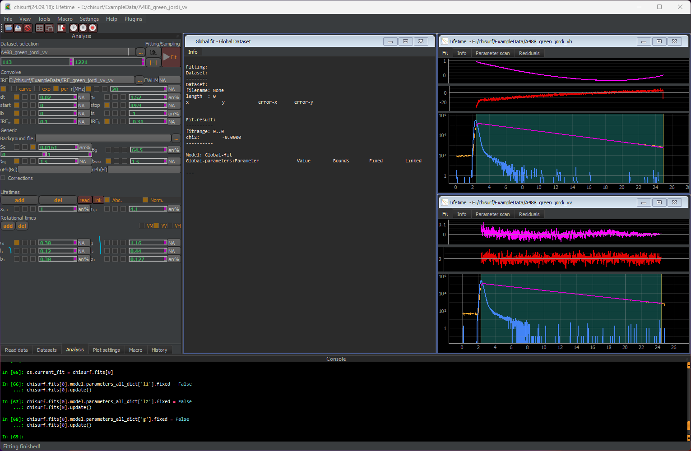
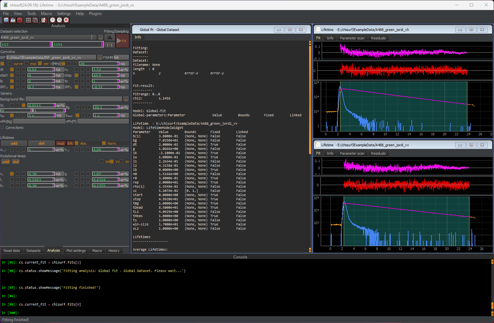
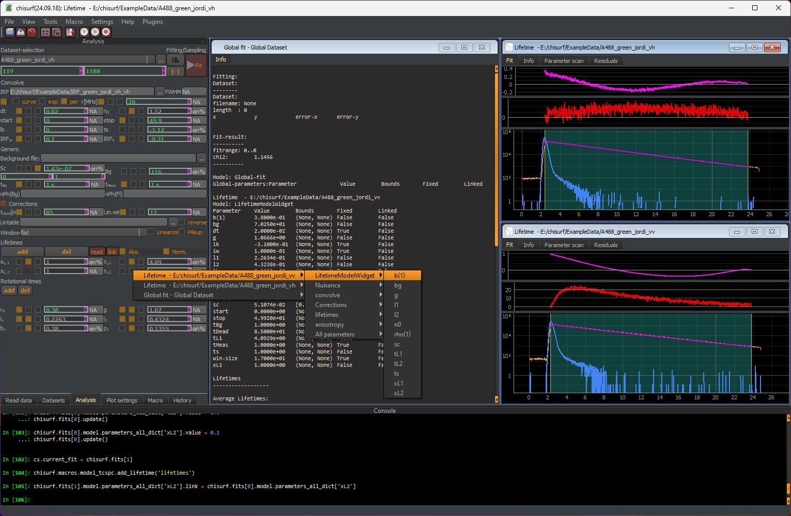

Step 2: Joint analysis to determine g-factor, ls and lp
"""""""""""""""""""""""""""""""""""""""""""""""""""""""

In the next step, the g-factor, l1 and l2 are no longer kept fixed to the initially estimated values but will also be fit and their respective check boxes are unticked.

Next, switch to the "Global fit" and press the fit button for the joint fit.

The fit is not yet good. It seems there is a component missing the in beginning of the decay. A second lifetime can be added and linked between VV and VH.

Once the modifications have been done to the VV and VH datasets, switch back to the "Global fit" and press the update button before performing a global fit again. Now, the fit looks good with flat residuals and a decaying autocorrelation function.
